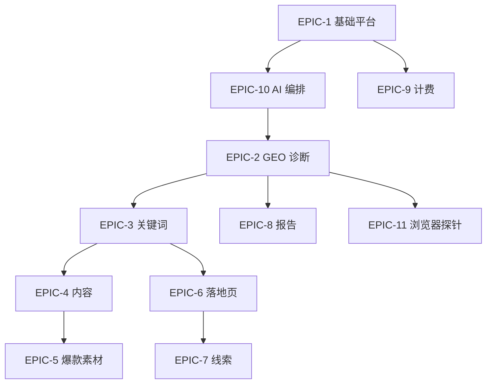

# AGENTS.md — AI 编码 Agent 工作指南

> 本文件指导 **Cursor Agent / Claude Code / 自动化编码 Agent** 在本仓库中如何安全、高效地实现功能。  
> 与 `CLAUDE.md`（项目上下文）配合使用：**CLAUDE.md = 是什么；AGENTS.md = 怎么做**。  
> **多窗口协作**：必读 `docs/agent-team/MEMORY.md`（§21）。

---

## 1. Agent 使命

将 `PRD_商业化版_V2.0.md` 中的 EPIC/FR **按依赖顺序**落地为可运行代码，同时：

- 遵守分层边界（Java 管事务，Python 管 AI）
- 使用文档指定的开源组件，不自研基础设施
- 保持最小 diff，不做无关重构
- 每个 Story 可独立验收

---

## 2. 开始任务前 Checklist

每次接到编码任务，**先执行**：

```
[ ] 确认 EPIC 编号与 FR 编号（如 EPIC-2 / FR-103）
[ ] 阅读 PRD 对应 FR 的验收标准
[ ] 阅读 ARCHITECTURE.md 对应服务模块（§6.x / §7.x）
[ ] 核对 database/ddl/001_schema.sql 是否已有相关表/字段
[ ] 确认改动属于哪一层（Java / Python / Admin / 扩展 / DDL）
[ ] 确认是否涉及 GEO —— 若是，必须 grounded-api 或 extension 路径
[ ] 评估 scope：只做用户要求的，不加「顺便优化」
```

**不要**在没有读 DDL 的情况下发明新表名或字段名。

---

## 3. 分层决策树

```
这个需求涉及 LLM / Embedding / RAG / 视频拆帧 / citations 解析？
├─ 是 → inbound-ai (Python)
└─ 否 → 涉及权限/计费/CRUD/状态机/MQ/报告模板？
    ├─ 是 → inbound-core (Java)
    └─ 否 → 涉及 UI 表单/列表/图表？
        ├─ 是 → inbound-admin (Vue)
        ├─ 落地页公开页 → inbound-landing (Astro)
        └─ 浏览器探针 → inbound-probe-extension (Plasmo)
```

---

## 4. 标准实现流程（每个 Story）

### Step 1 — 设计（脑中 30 秒，复杂任务写 brief）

- 输入/输出是什么？
- 改哪些表？增删哪些 API？
- 同步还是异步（MQ）？
- 是否需要 AI 回调？

### Step 2 — 数据层

1. 若缺表/字段 → 改 `database/ddl/001_schema.sql`（追加 migration 风格变更）
2. 同步 PRD §11 描述（若用户要求更新 PRD）
3. Java：Entity + Mapper + Repository
4. Python：Pydantic model + asyncpg query

### Step 3 — 业务层

**Java 模式**：

```
Controller (inbound-api)
  → ApplicationService (inbound-application)
    → Domain model / 状态机 (inbound-domain)
      → Mapper / MQ / Feign (inbound-infrastructure)
```

**Python 模式**：

```
Router (app/routers)
  → Service (app/services)
    → Agent (app/agents) 或 Worker (app/workers)
      → Tools: llm_gateway / rag_tool / citation_parser
```

### Step 4 — 集成

- Java → AI：Feign/RestTemplate + `AI_SERVICE_INTERNAL_TOKEN`
- 长任务：Java 发 RabbitMQ → Python worker 消费 → HTTP callback 写回
- Admin：Axios 封装 + 页面 + Pinia store（若需要）

### Step 5 — 验收

对照 PRD FR 验收标准 + ARCHITECTURE §15.2 MVP 清单逐项自测。

### Step 6 — 交付

- 向用户说明改了什么、如何验证
- **不要**主动 git commit（除非用户要求）

---

## 5. 模块 → 目录 → 服务映射

| PRD 模块 | Java 包/模块 | Python router | Admin 路由 |
|----------|---------------|---------------|------------|
| 客户项目 | `project-service` | `/ai/embed`, `/ai/rag/search` | `/projects/:id` |
| GEO 诊断 | `diagnostic-service` | `/ai/diagnose`, `/ai/score`, `/ai/parse-citations` | `/diagnostics` |
| 探针 | `diagnostic-service` (probe) | — | `/diagnostics/probe-nodes` |
| 关键词 | `keyword-service` | `/ai/keywords` | `/keywords` |
| 内容 Agent | `content-service` | `/ai/content` | `/content` |
| 落地页 | `landing-service` | `/ai/landing` | `/landing-pages` |
| 线索 | `lead-service` | `/ai/followup` | `/leads` |
| 报告 | `report-service` | — | `/reports` |
| 计费 | `billing-service` | — | `/settings/billing` |
| 权限 | `auth-service` | — | `/settings/members` |

---

## 6. GEO 诊断 Agent 专项规范

### 6.1 探针模式

| 模式 | 实现位置 | 触发 |
|------|----------|------|
| `grounded-api` | Python `diagnose_worker` + LiteLLM | MQ `diag.grounded-api` |
| `browser-extension` | Java probe 调度 + Plasmo 扩展 | 扩展 poll `/api/v1/probe/tasks/poll` |
| `headless-automation` | Python Playwright 脚本 | 节点不足时手动/自动兜底 |

### 6.2 Grounded API 强制检查（Python `llm_gateway.py`）

```python
# 伪代码 — 必须在执行前校验
if task.probe_mode == "grounded-api" and not config.grounding_enabled:
    raise ProbeConfigError("GEO diagnostic requires grounded API")
```

### 6.3 Citations 解析（`citation_parser.py`）

| 平台 | 输入 | 处理 |
|------|------|------|
| Perplexity | `response.citations[]` | `[1]` → index-1 映射 |
| Gemini | `groundingMetadata` | redirect URL 还原真实 domain |
| OpenAI | `web_search` annotations | 仅 cited 计入覆盖 |
| Extension | hook JSON `sources` | platform adapter 解析 |

**统一输出**：

```json
{
  "citations": [
    { "url": "...", "title": "...", "domain": "...", "rank": 1, "is_customer": false, "is_competitor": true }
  ],
  "mentioned_brands": ["China Highlights", "..."],
  "rank": 2
}
```

### 6.4 诊断状态机（Java 侧权威）

```
diagnostic_run: PENDING → RUNNING → SUCCESS | PARTIAL_FAILED | FAILED | CANCELLED
probe_task:     PENDING → DISPATCHED → RUNNING → SUCCESS | FAILED | RETRY
```

- 全部 `probe_task` 终态 → 调 `/ai/score` 聚合 → 更新 `geo_score`
- 部分失败 → `PARTIAL_FAILED`，仍可出报告并标注失败子任务

---

## 7. RAG / 知识库 Agent 规范

```
上传 → MinIO → knowledge_asset(PENDING)
     → MQ ai.embed
     → Docling 解析 → 512 token 切片 (overlap 64)
     → embedding → knowledge_chunk
     → vector_status = READY
```

检索：

```
query embed → pgvector top-20 → bge-reranker top-3 → 注入 Prompt（附 chunk_id）
```

- Python 负责全流程；Java 只触发 MQ 和查状态
- 检索 **必须** filter：`tenant_id` + `project_id`

---

## 8. 内容 / 落地页 Agent 规范

- LangGraph Agent 输出必须带 `needs_human_review: true`
- Prompt 从 `template` 表读取，**禁止**硬编码在代码里
- RAG context 注入时标注来源 chunk
- 内容 Agent 输出字段见 PRD §20.2
- 落地页 `content_json` 模块结构见 PRD §20.3

---

## 9. 浏览器扩展 Agent 规范（EPIC-11）

### 9.1 技术栈

- **Plasmo** + TypeScript + Chrome MV3
- 目录：`inbound-probe-extension/src/{background,contents,adapters,popup}`

### 9.2 采集原则

- ✅ 仅处理调度器下发的 `probe_task`
- ✅ 双通道：hook fetch/SSE（主）+ MutationObserver（兜底）
- ✅ 上报：`answer`, `citations`, `platform`, `timestamp`, 可选 `screenshot_base64`
- ❌ 不上传用户其他 tab/会话内容
- ❌ 不本地持久化业务数据

### 9.3 Adapter 热更新

- 配置存 `platform_adapter` 表
- 扩展启动时拉取 + 定时刷新（`chrome.alarms`）
- DOM/接口变更时只改 adapter，不改核心逻辑

### 9.4 频率控制

- 单节点单平台 ≥ 30s 间隔
- 拟人化输入延迟（random 200-800ms）
- 失败 → `RETRY`（最多 3 次）→ 切换节点

---

## 10. MQ 消息契约

| Queue | Producer | Consumer | Payload 关键字段 |
|-------|----------|----------|------------------|
| `diag.grounded-api` | diagnostic-service | ai diagnose_worker | `runId, questionId, platform, region, locale, sampleIndex` |
| `diag.probe-extension` | diagnostic-service | probe scheduler | `probeTaskId, question, platform, adapterVersion` |
| `ai.embed` | project-service | embed_worker | `assetId, tenantId, projectId, fileUrl` |
| `ai.content` | content-service | content_worker | `taskId, keywordId, tone, platform` |
| `ai.landing` | landing-service | landing_worker | `pageId, keywordId, templateType` |
| `report.generate` | report-service | report_worker | `reportId, type, period` |

- 手动 ACK；失败进 DLQ；最多 3 次重试
- 消息体 JSON 必须含 `trace_id`

---

## 11. API 实现模板

### Java Controller

```java
@RestController
@RequestMapping("/api/v1/projects/{projectId}/diagnostics")
@RequiredArgsConstructor
public class DiagnosticController {
    // 返回 ApiResponse<T>，含 trace_id
    // @PreAuthorize + Casbin 校验 project 范围
    // 创建任务 → 202 Accepted + runId（异步）
}
```

### Python Router

```python
@router.post("/ai/diagnose", response_model=DiagnoseResponse)
async def diagnose(req: DiagnoseRequest, _: None = Depends(verify_internal_token)):
    # Langfuse trace
    # grounding 校验
    # 返回统一结构，Java callback 写库
```

### Admin API 封装

```typescript
// src/api/diagnostic.ts
export function createDiagnosticRun(projectId: string, data: CreateDiagnosticDto) {
  return request.post<ApiResponse<{ runId: number }>>(`/projects/${projectId}/diagnostics`, data)
}
```

---

## 12. 测试策略

| 层 | 最低要求 |
|----|----------|
| Java | 状态机单元测试；租户隔离集成测试（跨 tenant 必须 403） |
| Python | citation_parser 分平台单测；scorer 权重计算单测；grounding 校验单测 |
| Admin | 关键表单校验；API mock 测试（可选） |
| 扩展 | adapter 解析单测（fixture JSON） |
| E2E | MVP 清单（ARCHITECTURE §15.2）手工或 Playwright |

**不要**写只断言 `true === true` 的无意义测试。

---

## 13. 错误处理

| 场景 | HTTP | code |
|------|------|------|
| 成功 | 200 | 0 |
| 参数错误 | 400 | 40001 |
| 未授权 | 401 | 40100 |
| 无权限/跨租户 | 403 | 40300 |
| 套餐超额 | 402 | 40201 |
| 资源不存在 | 404 | 40400 |
| 异步已接受 | 202 | 0 |
| 服务器错误 | 500 | 50000 |

- 日志：结构化 JSON，含 `trace_id`, `tenant_id`, `user_id`
- AI 失败：记录 Langfuse trace + 原始 error，**不**吞异常

---

## 14. 反模式（见到就停）

| 反模式 | 正确做法 |
|--------|----------|
| 在 Vue 里 fetch OpenAI | 走 Java API → Python AI |
| Java 里写 Prompt 字符串 | 存 `template` 表，Python 读取 |
| 新建 `diagnostics_v2` 表 | 用 PRD 已有表名 |
| 全文件格式化无关代码 | 只改任务相关行 |
| 一个 PR 混 3 个 EPIC | 按 EPIC 拆分 |
| 扩展读取全部 chat 历史 | 仅当前 probe_task |
| GEO 结果缓存 24h | 不缓存 |
| 用 LibreOffice 命令行拼 PDF | Gotenberg API |

---

## 15. 文件命名约定

| 类型 | 约定 | 示例 |
|------|------|------|
| Java 类 | PascalCase | `DiagnosticRunService` |
| Java 包 | lowercase | `com.inbound.diagnostic` |
| Python 模块 | snake_case | `citation_parser.py` |
| Vue 组件 | PascalCase 文件名 | `DiagnosticRunForm.vue` |
| Vue 页面 | kebab 路由 | `/diagnostics/runs/:id` |
| SQL | snake_case | `diagnostic_result` |
| 环境变量 | SCREAMING_SNAKE | `PERPLEXITY_API_KEY` |

---

## 16. Story 交付模板

完成任务后，向用户汇报：

```markdown
## 完成：FR-xxx — 功能名

**改动文件**
- path/a
- path/b

**如何验证**
1. 启动 xxx
2. 调用 xxx
3. 期望看到 xxx

**未做 / 后续**
- （若有 scope 裁剪，明确列出）
```

---

## 17. EPIC 依赖图



---

## 18. 与 Cursor Rules 的关系

| 文件 | 作用 |
|------|------|
| `CLAUDE.md` | 项目上下文（读一次） |
| `AGENTS.md` | 编码流程 + 多 Agent 共享记忆（每任务参照） |
| `.cursor/rules/agent-team-memory.mdc` | 强制读/写 `docs/agent-team/MEMORY.md` |
| `.cursor/rules/*.mdc` | 其他专项规则（如 QingTian MCP 保活） |

**优先级**：用户指令 > AGENTS.md 业务规范 > CLAUDE.md > .cursor/rules

QingTian MCP 规则仅影响 Cursor↔插件通信循环，**不改变**本项目的分层架构与 GEO 规范。

---

## 19. 快速命令参考

```bash
# 基础设施
cd deploy && docker compose up -d
cd deploy && docker compose ps
cd deploy && docker compose logs -f postgres

# 数据库
docker exec -it inbound-postgres psql -U inbound -d inbound_growth

# Java 构建（scaffold 后）
cd inbound-core && ./mvnw -q test

# Python 测试（scaffold 后）
cd inbound-ai && uv run pytest tests/ -q

# Admin（scaffold 后）
cd inbound-admin && pnpm build
```

---

## 20. 当前仓库状态（Agent 须知）

截至 2026-06-25，仓库已有：

- ✅ PRD、ARCHITECTURE、TECH_STACK 文档
- ✅ DDL + seed + docker-compose 基础设施
- ✅ `inbound-core` / `inbound-admin` — RuoYi-Vue-Plus + plus-ui 已拉取
- ⏳ `inbound-ai` 等待 scaffold；若依待切 PostgreSQL
- ✅ 多 Agent 共享记忆 — `docs/agent-team/`（**每窗口必读 MEMORY.md**）

**Agent 首次 scaffold 时**：

1. 先读 `docs/agent-team/MEMORY.md` 与 `DECISIONS.md`
2. 先跑通 `docker compose up` + DDL 迁移
3. 实现 EPIC-1 最小闭环（登录 → 创建项目 → 列表）
4. 不要跳过基础设施验证直接写 UI

---

## 21. 多 Agent 团队与共享记忆

> 参考 [agency-agents-main](agency-agents-main/) 的 **Handoff Templates**、**Agents Orchestrator** 思路；适配为本项目四角色。  
> **核心问题**：多个 Cursor 窗口互不共享会话 → 用 **仓库内文件** 作共享记忆。

### 21.1 四角色分工

| 角色 | 对标 agency-agents | 主责目录 | 核心产出 |
|------|-------------------|----------|----------|
| **技术总监** | Orchestrator + Software Architect | `docs/`、`docs/agent-team/` | EPIC 排期、ADR、HANDOFF、消阻塞 |
| **运维** | Infrastructure Maintainer + DevOps | `deploy/`、`cert/` | Compose、监控、环境文档、incident |
| **开发** | Backend Architect + AI Engineer + Frontend（API） | `inbound-core/`、`inbound-ai/`、`database/`、`inbound-probe-extension/` | 功能代码、DDL、MQ/API |
| **UI 设计** | UI Designer | `docs/design/`、`inbound-admin/src/`、`inbound-landing/` | Token、线框、组件态、设计 HANDOFF |

**协作边界**：

```
用户 / 产品
    ↓
技术总监 ──HANDOFF──→ 开发 / UI / 运维
    ↑                    ↓
    └──── MEMORY / DECISIONS 汇总 ────┘
```

| 场景 | 主责 | 协作 |
|------|------|------|
| EPIC/FR 拆分、架构争议 | 技术总监 | 开发评审可行性 |
| Docker / PG / 域名 / 证书 | 运维 | 开发改连接配置 |
| 后端 API、AI、DDL | 开发 | UI 对齐字段；运维对齐 env |
| Admin 页面视觉与交互 | UI 设计 | 开发实现 API 与组件 |
| GEO / 多租户 / 分层铁律 | 全员遵守 | 技术总监裁决 |

各角色激活 Prompt 与细则 → `docs/agent-team/ROLES/*.md`

### 21.2 共享记忆文件（Single Source of Truth）

| 路径 | 谁读 | 谁写 |
|------|------|------|
| `docs/agent-team/MEMORY.md` | **全部角色，任务开始** | **全部角色，任务结束**（只改自己章节 + 全局/阻塞/下一步） |
| `docs/agent-team/DECISIONS.md` | 全部 | 技术总监定案；他人可追加「待讨论」 |
| `docs/agent-team/HANDOFFS/*.md` | To 角色 | From 角色创建；To 角色填 Done |
| `docs/agent-team/HANDOFF-TEMPLATE.md` | — | 复制模板 |

**MEMORY.md 结构**（勿删章节标题）：全局状态 → 四角色各一节 → 阻塞项 → 下一步 → 更新日志

### 21.3 HANDOFF 规则（来自 agency-agents 精简版）

跨角色派活、联调、环境变更 **必须** 写 HANDOFF，避免「另一个窗口不知道」。

```markdown
# HANDOFF | 技术总监 → 开发

| From | To | 日期 | 关联 EPIC/FR |
|------|-----|------|--------------|
| 技术总监 | 开发 | 2026-06-25 | EPIC-1 |

## 上下文
当前状态：…
相关文件：`inbound-core/ruoyi-admin/.../application-dev.yml`

## 交付请求
将若依主库改为 PostgreSQL（compose 中 inbound-postgres），验收：启动无报错。

## 验收标准
- [ ] 连接 `inbound_growth` 库
- [ ] 更新 MEMORY.md 开发章节
```

**质量原则**（与 NEXUS 一致）：

- **Evidence over claims** — 运维附 `compose ps`；开发附启动日志；UI 附线框路径
- **Context continuity** — HANDOFF 写清文件路径，不假设对方看过聊天
- **Fail fast** — 阻塞写进 MEMORY **阻塞项**，@ 技术总监

### 21.4 每个 Agent 窗口的标准流程

```
1. 确认本窗口角色（Custom Instructions 或用户首句指定）
2. 读 docs/agent-team/MEMORY.md
3. 读 DECISIONS.md 最近 5 条
4. 读 HANDOFFS/ 里 To=本角色 的 open 项
5. 读 CLAUDE.md + 本角色 ROLES/*.md + AGENTS.md 相关 §
6. 执行任务（不越界）
7. 更新 MEMORY.md；必要时新建 HANDOFF 或 ADR
8. 向用户汇报（AGENTS.md §16 Story 模板）
```

### 21.5 Cursor 窗口配置建议

| 窗口 | Custom Instructions 首行 |
|------|-------------------------|
| 技术总监 | `角色：技术总监。必读 docs/agent-team/MEMORY.md` |
| 运维 | `角色：运维。必读 MEMORY.md，只改 deploy/` |
| 开发 | `角色：开发。必读 MEMORY.md，遵守 AGENTS.md §2-§4` |
| UI 设计 | `角色：UI 设计。必读 MEMORY.md 与 PRD §6.1` |

可复制完整 Prompt → `docs/agent-team/ROLES/` 对应文件。

### 21.6 禁止

- ❌ 不读 `MEMORY.md` 就开始改代码
- ❌ 不更新 `MEMORY.md` 就结束任务（另一窗口会丢上下文）
- ❌ 在聊天里口头交接代替 HANDOFF（聊天不跨窗口）
- ❌ 运维改业务 Java；开发定视觉；UI 改 DDL
- ❌ 子 Agent（Task 工具派发）写 MEMORY — **仅主窗口**维护共享记忆

---

*Last updated: 2026-06-25 | 配合 CLAUDE.md + PRD V2.0 + docs/agent-team/ 使用*
