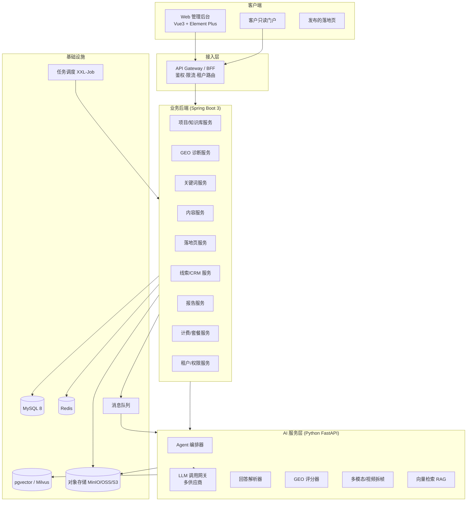
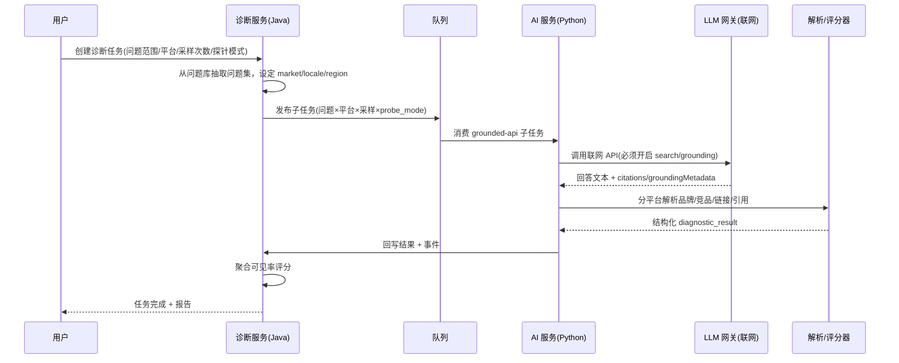
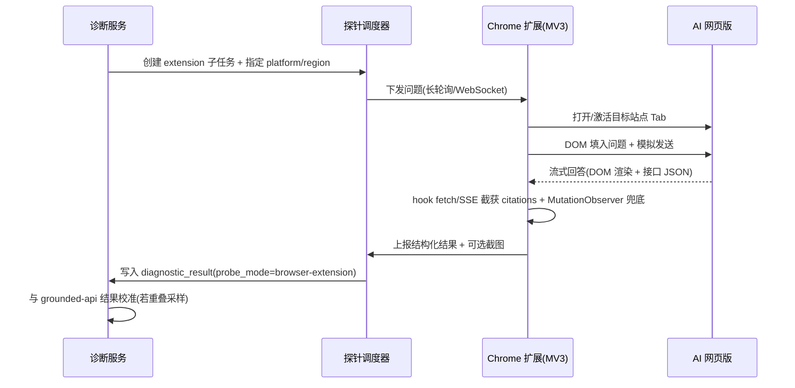
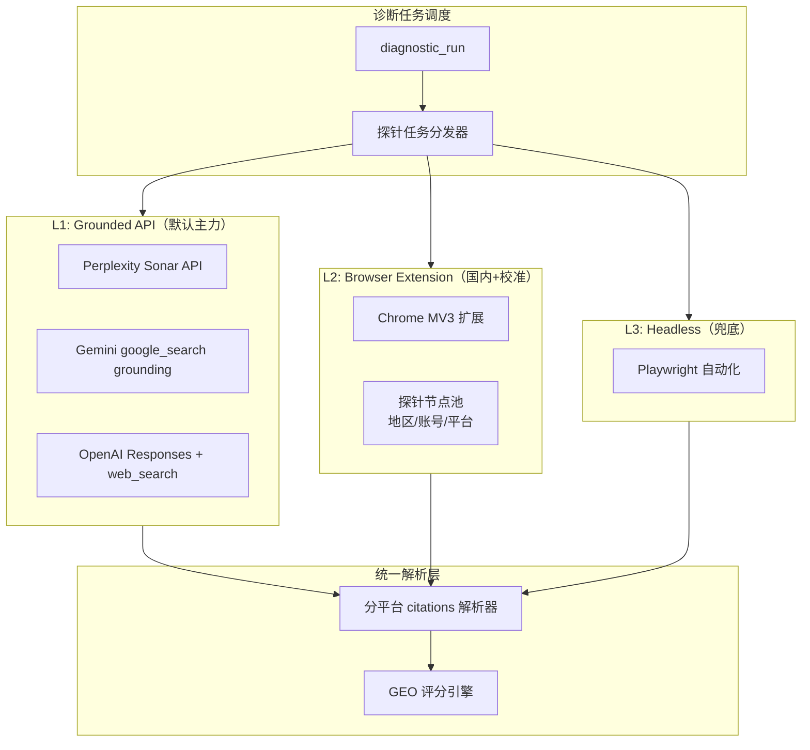
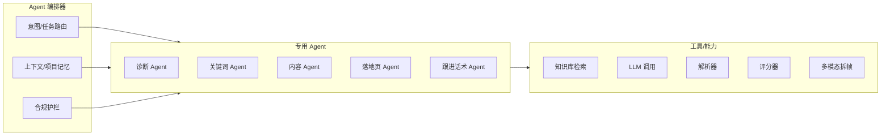
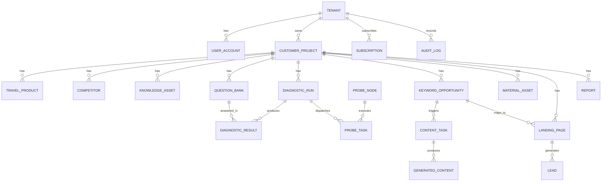

# 中国入境游海外获客增长 Agent — 商业化版产品需求文档（PRD）

> GEO 诊断 · 海外关键词洞察 · 社媒内容 Agent · 落地页生成 · 询盘转化 · 增长闭环

| 项目 | 内容 |
|------|------|
| 文档版本 | **V2.0（商业化完整版）** |
| 编写日期 | 2026-06-23 |
| 产品阶段 | 商业化版（Commercial / SaaS + 服务 + OEM） |
| 上游文档 | V1.0 MVP PRD（2026-06-18） |
| 目标客户 | 中国入境游旅行社、地接社、文旅局海外营销部门、旅游营销服务商 |
| 核心定位 | 帮助文旅企业发现海外游客真实需求，提升 AI 问答可见率，自动生成社媒内容、英文落地页与询盘转化素材，并打通从流量到询盘到复购的增长闭环。 |
| 文档用途 | **作为后续完整规划与 AI Coding 的工程基线**，覆盖功能、数据、接口、Agent 编排、计费、指标与排期。 |

---

## 文档修订记录

| 版本 | 日期 | 作者/角色 | 变更说明 |
|------|------|-----------|----------|
| V1.0 | 2026-06-18 | 产品规划 | MVP 范围 PRD，覆盖核心闭环。 |
| V2.0 | 2026-06-23 | 产品规划 | 补充 GEO 探针采集架构（grounded-api / browser-extension / headless）、FR-111~118、EPIC-11、探针数据表与 API。 |

---

## 目录

1. [产品背景与商业判断](#1-产品背景与商业判断)
2. [产品定位与商业目标](#2-产品定位与商业目标)
3. [目标用户与核心场景](#3-目标用户与核心场景)
4. [产品范围与版本规划](#4-产品范围与版本规划)
5. [系统架构总览](#5-系统架构总览)
6. [产品信息架构与导航](#6-产品信息架构与导航)
7. [核心业务流程](#7-核心业务流程)
   - [7.6 GEO 探针采集架构](#76-geo-探针采集架构)
8. [功能需求详述（FR 全集）](#8-功能需求详述-fr-全集)
9. [AI / Agent 能力与编排设计](#9-ai--agent-能力与编排设计)
10. [GEO 评分模型与算法](#10-geo-评分模型与算法)
11. [数据模型与数据库设计](#11-数据模型与数据库设计)
12. [API 设计规范](#12-api-设计规范)
13. [多租户、权限与计费体系](#13-多租户权限与计费体系)
14. [指标体系、埋点与报表](#14-指标体系埋点与报表)
15. [非功能需求](#15-非功能需求)
16. [合规、安全与风险控制](#16-合规安全与风险控制)
17. [商业化与交付模式](#17-商业化与交付模式)
18. [研发里程碑与排期](#18-研发里程碑与排期)
19. [验收标准与上线清单](#19-验收标准与上线清单)
20. [附录](#20-附录)
21. [技术选型与开源依赖清单](#21-技术选型与开源依赖清单)

---

## 1. 产品背景与商业判断

### 1.1 行业背景

中国入境游企业正在面对获客入口的结构性迁移：海外游客不再只通过传统搜索引擎和 OTA 查找路线，越来越多的种草、规划、比较和决策行为发生在短视频平台、社媒内容、AI 问答和即时通讯咨询中。

旅行社、地接社、文旅资源方的核心矛盾不是"是否使用 AI"，而是"**不知道海外用户到底在问什么、看什么、信什么，以及如何把这些洞察持续转化为可度量的获客动作**"。

### 1.2 关键洞察 → 产品机会

| 洞察 | 含义 | 对应产品能力 |
|------|------|--------------|
| 大词难竞争，长尾词有机会 | 小旅行社难抢 `China travel` 大词，但可在细分路线/场景/评价上占位 | 关键词机会识别、长尾页面生成、GEO 问题库测试 |
| AI 可见率成为新指标 | 通过大量用户问题测试品牌在 AI 回答中的出现频次与排名 | AI 可见率诊断、竞品对比、周期监控 |
| 海外用户需求差异大 | 不同国家/年龄/兴趣关注点不同 | 国家维度词库 + 用户生命周期八阶段词库 |
| 社媒内容生产链路复杂 | 从关键词到脚本/素材/拆解/分镜/发布需大量人工 | 内容 Agent、爆款拆解、素材检索、脚本生成 |
| 工具必须结合专家 Know-how | 纯工作流/Prompt 效果不稳定 | 客户知识库、行业策略库、专家规则引擎 |
| 官网需要承接询盘 | 社媒/AI 流量需要英文落地页 + 表单 + WhatsApp 承接 | 落地页生成、询盘管理、渠道追踪 |

### 1.3 问题定义

| 编号 | 问题 | 当前影响 | 解决方向 |
|------|------|----------|----------|
| P01 | 客户不知道品牌是否被 AI 推荐 | 无法判断 GEO 投入方向 | AI 可见率诊断 + 竞品对比 |
| P02 | 客户不知道海外游客真实搜索意图 | 内容选题靠感觉、命中率低 | 海外关键词洞察 + 生命周期词库 |
| P03 | 运营团队英文社媒内容产能不足 | 无法持续发布高质量内容 | 短视频脚本 Agent + 发布计划 |
| P04 | 爆款视频难以拆解和复用 | 只会表层模仿 | 视频拆帧 + 七维度拆解 |
| P05 | 官网无法承接细分需求 | 用户看完内容无高转化路径 | 关键词落地页生成 + 表单/WhatsApp |
| P06 | 老客触达粗放 | 群发打扰、复购流失 | 行为预警 + 差异化触达建议 |
| P07（商业版新增） | 无法量化"内容/页面 → 询盘"的 ROI | 续费缺乏数据支撑 | 渠道归因 + 增长报表 + CRM |
| P08（商业版新增） | 服务商无法标准化、规模化交付 | 人工重、复制难、毛利低 | 多租户 + 白标 + 交付 SOP 模板 |

---

## 2. 产品定位与商业目标

### 2.1 产品名称与定位

- **建议产品名**：Inbound AI Growth Agent / 旅获 AI / TourGEO Agent
- **定位**：面向中国入境游与文旅企业的 **AI 海外获客增长 Agent**，提供「市场洞察 → GEO 诊断 → 内容生产 → 落地页承接 → 询盘转化 → 复购触达 → 周报优化」的完整闭环。

### 2.2 产品边界（不是什么）

- 不是单纯聊天机器人：聊天只是交互形式，核心是诊断、生产与转化闭环。
- 不是简单 Prompt 工具：内置旅游行业知识库、路线库、海外词库与专家规则。
- 不是"保证 AI 必定推荐"的黑盒：目标是提升可见率、覆盖率、被引用概率与内容资产质量。
- 不是素材搬运工具：支持爆款结构分析与自有/授权素材调用，不鼓励侵权搬运。

### 2.3 核心价值主张

| 客户角色 | 价值主张 | 可量化结果 |
|----------|----------|------------|
| 旅行社老板 | 知道海外客户在哪、问什么、该做什么内容 | 更多询盘、更低获客成本 |
| 运营负责人 | 选题/脚本/分镜/落地页快速生成 | 内容产能提升、人员依赖降低 |
| 销售/客服 | 基于客户行为获得差异化触达建议 | 回复效率、转化率、复购率提升 |
| 文旅局/集团 | 统一管理目的地内容资产与渠道效果 | 形成可复用区域营销知识库 |
| 营销服务商 | 可贴牌交付 GEO + 内容增长服务 | 服务标准化、毛利率提升 |

### 2.4 商业目标（分阶段）

| 阶段 | 时间 | 目标 | 关键指标 |
|------|------|------|----------|
| MVP 验证 | 0-8 周 | 可演示系统 + 3 家种子客户 | 诊断报告可用率 ≥ 90%；内容采纳率 ≥ 50% |
| 商业试点 | 2-4 个月 | 诊断 + 月服务套餐，10-20 家付费 | 月复购率 ≥ 60%；单客户月均内容 ≥ 30 条 |
| SaaS 化 | 4-8 个月 | 标准化账号/权限/模板/周报/后台 | MRR 稳定增长；客户自主使用率 ≥ 40% |
| OEM/行业版 | 8-12 个月 | 文旅集团/服务商私有化或贴牌 | 单项目客单价 5 万-20 万+ |

---

## 3. 目标用户与核心场景

### 3.1 用户画像

| 画像 | 特征 | 痛点 | 使用频率 |
|------|------|------|----------|
| 小型入境游旅行社老板 | 5-30 人，有路线缺海外营销 | 不知道海外怎么获客、英文弱 | 每周看报告、每月购买 |
| 地接社/资源方 | 拥有目的地/司机/导游/酒店资源 | 缺品牌曝光与询盘承接 | 每周生成内容与落地页 |
| 旅游内容运营 | 负责 TikTok/IG/YouTube/小红书/视频号 | 选题焦虑、脚本效率低、素材难找 | 每日使用 |
| 销售/客服 | 负责询盘跟进、报价、定制沟通 | 不知何时触达、如何个性化 | 每日使用 |
| 文旅局/集团营销负责人 | 关注国际传播、统一资产 | 缺跨市场策略与效果监控 | 每周/月 |
| 旅游营销服务商 | 服务多家旅行社，想标准化 | 人工交付重、复制难 | 每日/每周 |

### 3.2 核心使用场景

| 编号 | 场景 | 用户目标 | 系统输出 |
|------|------|----------|----------|
| S01 | AI 可见率诊断 | 知道 AI 是否推荐我 | 诊断分、被推荐次数、竞品榜、问题清单、优化建议 |
| S02 | 目标市场关键词洞察 | 知道某国游客最近关注什么 | 关键词矩阵、生命周期阶段、优先级、渠道建议 |
| S03 | 短视频选题与脚本生成 | 快速生成本周内容 | 标题、脚本、分镜、字幕、CTA、标签 |
| S04 | 爆款视频拆解 | 理解竞品为何火 | 镜头拆解、情绪点、用户心理、可复用结构 |
| S05 | 英文落地页生成 | 每个细分关键词都有承接页 | 大纲、英文文案、FAQ、表单、SEO/GEO 元数据 |
| S06 | 周报与增长建议 | 知道本周该优化哪里 | 可见率变化、竞品动态、内容/页面任务、询盘建议 |
| S07 | 老客复购提醒 | 识别复购信号 | 行为提醒、话术建议、推荐产品 |
| S08（商业版） | 渠道 ROI 复盘 | 知道哪些内容/页面/词带来询盘 | 归因报表、转化漏斗、续费数据支撑 |
| S09（商业版） | 服务商批量交付 | 一人管多客户、标准化产出 | 多项目工作台、批量任务、白标报告 |

---

## 4. 产品范围与版本规划

### 4.1 商业化版总范围

商业化版以 **MVP 验证过的核心闭环为底座**，向四个方向扩展：**自助 SaaS 化、内容运营增强、增长数据闭环、平台化（OEM/私有化）**。


### 4.2 版本路线图

| 版本 | 目标 | 关键能力 | 交付形态 |
|------|------|----------|----------|
| V0.5 MVP | 拿种子客户 | GEO 诊断、关键词洞察、社媒脚本、落地页草稿、周报 | Web 后台 + 手工辅助 |
| **V1.0 商业版** | 形成可收费套餐 | 账号/权限/套餐计费、定时任务、模板库、报告白标导出、线索追踪 | SaaS + 服务 |
| **V1.5 内容增强版** | 提升内容产能 | 爆款拆解、素材标签库、批量内容计划、多语言文案 | 运营工作台 |
| **V2.0 增长闭环版** | 打通转化数据 | 落地页发布、表单/WhatsApp/UTM 追踪、轻量 CRM、复购预警、广告数据接入 | 增长系统 |
| **V3.0 OEM/私有化** | 服务大客户 | 多租户、品牌白标、知识库私有化、审计、部署工具 | 私有化/OEM |

### 4.3 模块范围矩阵（按版本）

| 模块 | V0.5 | V1.0 | V1.5 | V2.0 | V3.0 |
|------|:----:|:----:|:----:|:----:|:----:|
| 客户项目管理 | ✅ | ✅+ | ✅ | ✅ | 多租户隔离 |
| 知识库（上传/检索/RAG） | 基础 | ✅ | 向量检索 | ✅ | 私有化 |
| GEO 诊断 | ✅ | ✅+（grounded-api 强制） | ✅ | 趋势/预警 | ✅ |
| **浏览器扩展探针** | — | ✅（校准+国内） | ✅ | ✅ | 可选私有化节点 |
| 问题库管理 | ✅ | ✅ | 模板市场 | ✅ | 行业库私有化 |
| 关键词机会识别 | ✅ | ✅ | 跨市场模板 | 效果回传 | ✅ |
| 社媒内容 Agent | ✅ | ✅+ | 多语言/语气 | ✅ | ✅ |
| 爆款拆解与素材库 | Beta | 部分 | ✅ | ✅ | ✅ |
| 落地页 Agent | 草稿/导出 | ✅+ | ✅ | 发布/CMS | ✅ |
| 线索与转化 | 轻量 | 表单/点击追踪 | ✅ | 完整 CRM/归因 | ✅ |
| 复购触达 | — | — | — | ✅ | ✅ |
| 广告数据接入 | — | — | — | ✅ | ✅ |
| 报告中心 | 诊断/周报 | + 白标/导出 | + 月报 | 全量增长报表 | + 多租户 |
| 计费/套餐 | — | ✅ | ✅ | ✅ | 项目制/私有化 |
| 后台管理/审计 | 基础 | ✅ | ✅ | ✅ | 审计/部署工具 |

> 图例：✅ 完整支持；✅+ 在上一版基础上强化；— 不包含。

---

## 5. 系统架构总览

### 5.1 总体架构



### 5.2 技术栈建议

| 层 | 技术 | 说明 |
|----|------|------|
| 前端 | Vue3 + TypeScript + Element Plus + Pinia + Vite | 后台、报告预览、内容/落地页编辑器 |
| 落地页渲染 | Nuxt3 / 静态生成（SSR/SSG） | 利于 SEO/GEO 被抓取与引用 |
| 后端 | Spring Boot 3 + MyBatis-Plus + MySQL 8 + Redis | 主业务、事务、权限、计费 |
| AI 服务 | Python FastAPI 独立微服务 | LLM 调用、解析、评分、多模态、RAG |
| LLM 网关 | 多供应商抽象（OpenAI/Gemini/Perplexity/国产模型） | 失败重试、限额、A/B、成本核算 |
| 任务调度 | XXL-Job（或 Quartz / Celery） | 诊断、周报、监控、批量生成 |
| 消息队列 | RabbitMQ / Kafka | 异步任务解耦、削峰 |
| 向量库 | pgvector（起步）/ Milvus（规模化） | 知识库 RAG、内容引用 |
| 对象存储 | MinIO（自建）/ OSS / S3 | 资料、报告、素材、视频帧、导出 |
| 部署 | Docker Compose 起步 → Kubernetes | MVP 快上线，商业版扩展，V3 私有化 |
| 可观测 | Prometheus + Grafana + ELK/Loki | 性能、任务、成本、日志监控 |

### 5.3 服务划分原则

- **主业务后端（Java）**：事务一致性强的领域（项目、计费、权限、线索、报告元数据）。
- **AI 服务（Python）**：模型调用、解析、评分、多模态、向量检索等 CPU/IO/GPU 密集且演进快的能力，独立伸缩。
- **两者通过内部 API + 消息队列协作**：长耗时任务（诊断/批量生成）走异步，结果回写 + 事件通知。

---

## 6. 产品信息架构与导航

### 6.1 一级导航

| 一级模块 | 二级页面 | 说明 |
|----------|----------|------|
| 工作台 | 项目概览 / 今日任务 / 本周建议 / 预警中心 / 转化漏斗摘要 | 客户项目健康度与待办 |
| 客户项目 | 品牌资料 / 产品路线 / 目标市场 / 竞品 / 知识库 | 基础信息与内容资产 |
| GEO 诊断 | 问题库 / 诊断任务 / 诊断结果 / 竞品对比 / 趋势监控 / **探针节点** | 核心 AI 可见率能力 + 浏览器扩展探针管理 |
| 关键词洞察 | 机会词库 / 生命周期词库 / 内容选题 / 页面建议 / 效果回传 | 需求洞察到内容与页面 |
| 内容 Agent | 脚本生成 / 分镜生成 / 爆款拆解 / 素材库 / 发布计划 | 社媒内容生产 |
| 落地页 Agent | 页面模板 / 页面草稿 / FAQ / 表单配置 / 发布记录 / 转化数据 | 细分需求承接 |
| 线索与转化 | 表单线索 / WhatsApp 点击 / 渠道来源 / CRM 跟进 / 复购预警 | 转化闭环 |
| 报告中心 | 诊断报告 / 周报 / 月报 / 自定义报告 / 导出 | 客户交付 |
| 系统设置 | 成员权限 / 模型配置 / 模板配置 / 计费套餐 / 白标设置 / 审计日志 | 后台管理 |

### 6.2 增长闭环

```
客户资料录入 → AI 问题库测试 → 可见率诊断 → 关键词机会识别 → 内容脚本生成
→ 英文落地页生成 → 发布 → 社媒/广告/AI 问答流量进入 → 表单/WhatsApp 询盘
→ CRM 跟进 → 渠道归因 → 复购触达 → 周报/月报复盘 → 新一轮优化
```

---

## 7. 核心业务流程

### 7.1 新客户开通流程

1. 服务商管理员创建客户企业与项目。
2. 录入官网、品牌名、主推产品、目标市场、服务语言、竞品名单。
3. 客户上传路线、价格、案例、评价、图片、FAQ 等知识资料（进入知识库 → 向量化）。
4. 系统自动生成初始问题库与关键词种子库。
5. 运营确认诊断范围后发起首次 GEO 可见率诊断。
6. 生成诊断报告，并转化为内容任务、落地页任务和优化建议。
7. 系统按套餐分配额度，开始计费周期。

### 7.2 GEO 诊断流程

GEO 诊断的核心是模拟**真实用户在 AI 里提问时，品牌是否被推荐、是否被引用**。探针必须采集**联网检索后的回答**（含 citations），而非裸模型训练记忆。

#### 7.2.1 三种探针采集模式

| 模式 | 代码标识 | 适用场景 | 优先级 |
|------|----------|----------|:------:|
| **联网 Grounded API** | `grounded-api` | 海外主力：Perplexity Sonar、Gemini `google_search` grounding、OpenAI Responses + `web_search` | **默认主力** |
| **浏览器扩展探针** | `browser-extension` | 国内模型（豆包/文心/Kimi/元宝/DeepSeek 等）+ 海外网页版校准（ChatGPT/Gemini/Perplexity 网页版真实结果） | V1.0 补充 |
| **Headless 自动化** | `headless-automation` | 小批量补充、无插件节点时的兜底；Playwright 模拟提问 | 可选/校准 |

**推荐组合策略：**

```
默认诊断任务 = grounded-api（100% 子任务）
校准抽样任务 = browser-extension（5%~10% 重叠问题，与 API 结果对比）
兜底           = headless-automation（插件节点不足时）
```

#### 7.2.2 诊断主流程（Grounded API 路径）



#### 7.2.3 浏览器扩展探针路径



**关键点：**
- 子任务粒度 = 问题 × 平台 × 采样次数 × **探针模式**；支持断点续跑与部分失败查看。
- **诊断类 API 调用必须显式开启联网检索**（grounding / web_search），并配置目标 `market`、`locale`、`region`（海外探针需海外出口 IP）。
- 每个问题支持 `sample_count` 多次采样取均值，单次结果不可作为 GEO 结论。
- 解析结果可人工修正；评分规则可配置（见第 10 章）。
- 未覆盖问题自动沉淀为关键词/页面任务（候选池）。
- 详见 [7.6 GEO 探针采集架构](#76-geo-探针采集架构)。

### 7.3 社媒内容生成流程

1. 用户选择目标市场、平台、目的地、产品类型、内容目标、品牌语气。
2. 系统读取关键词机会库、客户知识库（RAG）、平台内容模板。
3. 生成多个选题 + 推荐理由 + 目标人群。
4. 用户选题后生成脚本、分镜、字幕、封面标题、标签、CTA。
5. 系统生成对应落地页建议或跳转链接（内容 ↔ 页面绑定）。
6. 导出或加入发布计划排期表。

### 7.4 落地页生成与发布流程

1. 用户选择关键词或内容选题。
2. 系统匹配模板（目的地页/路线页/签证政策页/主题游页/活动页）。
3. 基于知识库（RAG）生成英文文案、FAQ、服务包含项、信任背书、表单 CTA、SEO/GEO 元数据。
4. 用户编辑模块、替换图片、调整 CTA 与 WhatsApp 链接。
5. 页面进入待发布 → 发布（内置托管 / CMS 同步 / 导出 HTML/Markdown/Word）。
6. 发布后注入埋点（UTM、表单、WhatsApp 点击）→ 回流线索与转化数据。

### 7.5 询盘到复购流程（V2.0）

1. 落地页/社媒带来流量 → 表单提交或 WhatsApp 点击 → 生成线索。
2. 线索带来源页面/关键词/UTM/设备维度归因。
3. 进入 CRM：新线索 → 跟进中 → 报价 → 成交/流失，配跟进话术建议。
4. 成交客户进入复购监控：重复访问、产品查看等行为触发复购信号。
5. 系统输出差异化触达建议与推荐进阶路线。

### 7.6 GEO 探针采集架构

> 本章定义 GEO 诊断的**数据采集层**。产品壁垒在评分规则与行业词库，探针层优先复用成熟方案：**海外用联网 API，国内与网页版校准用浏览器扩展，Headless 仅作兜底**。

#### 7.6.1 为什么需要多种探针

| 问题 | 说明 | 对应探针 |
|------|------|----------|
| 裸 API 不测 GEO | 不联网的模型回答来自训练记忆，不是真实检索推荐 | 必须 `grounded-api` |
| 国内模型无稳定联网 API | 豆包/文心/Kimi 等网页版与 API 行为差异大 | `browser-extension` |
| 客户要「真实网页版截图」 | API 与网页版 system prompt、个性化存在差异 | `browser-extension` 抽样校准 |
| 规模化与合规 | 全量网页自动化易封禁、违反 ToS | API 为主，插件众包为辅 |

#### 7.6.2 三层采集架构



#### 7.6.3 各平台探针映射（本产品目标市场）

| AI 平台 | 推荐探针模式 | 联网方式 | 引用数据来源 |
|---------|--------------|----------|--------------|
| Perplexity | `grounded-api` | Sonar API 内置搜索 | 响应 `citations[]`，URL 可直接匹配客户官网 |
| Gemini | `grounded-api` | `google_search` tool | `groundingMetadata`；URL 可能为 redirect，需还原真实域名 |
| ChatGPT | `grounded-api` + `browser-extension` 校准 | Responses API `web_search` | 区分「读取页面」与「真正引用」；网页版用插件截获 |
| 豆包 / 文心 / Kimi / 元宝 / DeepSeek | `browser-extension` | 网页版内置搜索 | hook 页面 fetch/SSE 原始 JSON 中的 sources |
| 上述平台（无 API 时） | `headless-automation` | 网页版 | DOM + 网络拦截，维护成本高，仅兜底 |

#### 7.6.4 浏览器扩展探针：操作原理（国内 GEO 主流做法）

**端到端流程：**

1. **探针节点注册**：用户/运营安装 Chrome 扩展（Manifest V3），扩展向后台注册 `probe_node`（节点 ID、地区、可用平台、心跳）。
2. **任务拉取**：调度器按 `region`、`platform`、频率限制向节点下发 `probe_task`（问题文本、目标站点、采样序号）。
3. **自动提问**：Content Script 在目标 AI 页面 DOM 填入问题并模拟发送；必要时用 `chrome.tabs` 在后台 Tab 执行，降低打扰。
4. **双通道抓取**（推荐混用）：
   - **网络拦截（主）**：向页面 Main World 注入脚本，hook `fetch` / `XMLHttpRequest` / `EventSource`，截获流式接口原始 JSON → 提取回答正文、`sources`/`citations`、引用卡片排序。
   - **DOM 监听（兜底）**：`MutationObserver` 监听回答区域 DOM，流式结束后提取可见文本；引用链接从渲染后的引用卡片二次解析。
5. **结果上报**：扩展将结构化 JSON + 可选页面截图上传至探针 API；**不上传用户其他对话内容**（见合规 16 章）。
6. **后台聚合**：写入 `diagnostic_result`，与 API 探针结果走同一套评分引擎。

**Manifest V3 实现要点：**

| 约束 | 应对 |
|------|------|
| Service Worker 会休眠 | 用 `chrome.alarms` 定时拉任务；状态存 `chrome.storage` |
| 无法阻塞式读 webRequest body | 不用 webRequest 读 body；改用 Main World hook fetch |
| 平台 DOM/接口频繁变更 | 每平台维护 `platform_adapter` 配置（选择器、接口 URL 特征、解析 JSONPath） |
| 频率风控 | 节点级限速（如每平台 ≥30s 间隔）、拟人化输入延迟、分布式众包 |

**规模化：探针节点池（众包/分布式）**

- 将扩展部署到**客户运营浏览器、兼职探针、不同地区设备**，形成分布式探针网络。
- 调度器按 `target_market` 匹配节点地区（如美国探针测美国用户视角）。
- 控制单节点日请求量，避免触发平台风控。
- V1.0 可先支持「服务商自有节点 + 种子客户自愿安装」；V2.0 再扩展外部众包。

#### 7.6.5 Grounded API 探针：配置要求

| 平台 | 必开能力 | 地区/语言 |
|------|----------|-----------|
| Perplexity | `sonar` / `sonar-pro` 模型 | `search_recency_filter`、可选 `search_domain_filter` |
| Gemini | `tools: [{ google_search: {} }]` | 请求级 locale；海外探针走海外 Vertex/AI Studio 区域 |
| OpenAI | Responses API + `web_search` tool | 用户 location hint；记录 `web_search_call` 引用 |

**禁止**：用不带联网能力的 Chat Completions 裸调用做 GEO 诊断（结果无效）。

#### 7.6.6 分平台引用解析规则（FR-104 实现基线）

| 平台 | 解析输入 | 特殊处理 |
|------|----------|----------|
| Perplexity Sonar | `citations[]` + 正文 `[1][2]` 标记 | 1-based 标记映射 0-based 数组 |
| Gemini grounding | `groundingMetadata.groundingChunks` | redirect URL 需 HTTP 跟随或 API 还原真实域名后再匹配客户 `website` |
| OpenAI web_search | `message.annotations` / tool output | 区分 retrieved vs cited；仅 cited 计入引用覆盖 |
| 浏览器扩展（通用） | hook 到的 SSE/JSON 中 `sources`/`references` 字段 | 每平台 adapter 独立；DOM 兜底时解析引用卡片 `href` |
| 统一输出 | `citations[{url, title, domain, rank, is_customer, is_competitor}]` | 域名匹配客户官网、竞品官网 |

#### 7.6.7 API 与 Headless 探针（简要）

- **Grounded API**：经 LiteLLM 网关统一调用，强制 `grounding=true`，记录 token 成本（见 9.4、21 章）。
- **Headless**：Python Playwright，维护账号 cookie 池；易触发验证码，**仅作插件节点不足时的兜底**，不作为默认路径。

---

## 8. 功能需求详述（FR 全集）

### 8.1 优先级定义

| 优先级 | 定义 |
|--------|------|
| P0 | MVP 必须实现，核心闭环依赖 |
| P1 | 商业版（V1.0）强需求 |
| P2 | 增强体验/效率（V1.5） |
| P3 | 长期能力（V2.0+，依赖数据/预算/第三方） |

### 8.2 客户项目管理

| 编号 | 功能 | 优先级 | 需求描述 | 验收标准 |
|------|------|:------:|----------|----------|
| FR-001 | 创建客户项目 | P0 | 填写客户名、品牌名、官网、行业、目标国家、服务语言、主推路线 | 创建后进入项目工作台 |
| FR-002 | 竞品管理 | P0 | 录入竞品名/官网/社媒/主推产品/备注 | 每项目至少可维护 5 个竞品 |
| FR-003 | 产品路线管理 | P0 | 录入路线名/目的地/天数/价格区间/适合人群/亮点/服务包含 | 可被内容与落地页 Agent 调用 |
| FR-004 | 知识资料上传 | P1 | 上传 DOCX/PDF/TXT/图片，形成知识库 | 上传后可检索并标记类型 |
| FR-005 | 知识库向量化检索 | P1 | 资料切片向量化，支持语义检索供 RAG 调用 | 内容/页面生成可引用知识库片段并标注来源 |
| FR-006 | 项目健康度看板 | P2 | 聚合可见率、内容量、页面量、线索量趋势 | 工作台可视化展示 |

### 8.3 GEO 诊断模块

| 编号 | 功能 | 优先级 | 需求描述 | 验收标准 |
|------|------|:------:|----------|----------|
| FR-101 | 问题库生成 | P0 | 按市场/路线/竞品/用户阶段生成提问库 | 每次诊断至少生成 100 个问题 |
| FR-102 | 问题库编辑 | P0 | 新增/修改/删除/启用/停用问题 | 编辑后可立即用于诊断 |
| FR-103 | 批量诊断任务 | P0 | 选择问题范围/平台/探针模式/采样次数/地区语言创建任务 | 支持 `grounded-api`/`browser-extension`/`headless`；状态：待执行/执行中/成功/失败/部分失败 |
| FR-104 | 回答解析 | P0 | 分平台解析品牌/竞品/链接/引用/排序；支持 API citations 与扩展 hook JSON | 支持 Perplexity/Gemini/OpenAI/网页版 adapter；Gemini redirect 还原；结果可人工修正 |
| FR-105 | 可见率计算 | P0 | 计算出现率/Top3 率/竞品占比/覆盖率/引用链接数 | 生成可见率评分与趋势 |
| FR-106 | 诊断报告导出 | P0 | 导出 DOCX/PDF，含问题/答案摘要/评分/建议 | 可用于客户交付 |
| FR-107 | 竞品动态监控 | P1 | 周期监控竞品在 AI 回答中变化 | 高频竞品/新词触发预警 |
| FR-108 | 诊断趋势对比 | P1 | 多次诊断历史趋势可视化对比 | 展示可见率变化曲线 |
| FR-109 | 定时诊断任务 | P1 | 按周/月自动发起诊断 | 到点自动执行并通知 |
| FR-110 | 多平台采样配置 | P1 | 配置参与诊断的平台、探针模式、模型及权重 | 每平台可指定默认 probe_mode |
| FR-111 | 探针模式策略 | P1 | 任务级配置默认模式 + 校准抽样比例（如 API 100% + 扩展 10% 重叠） | 报告标注采样模式与时间 |
| FR-112 | 浏览器扩展探针 | P1 | Chrome MV3 扩展：拉取任务、自动提问、hook 抓取、结果上报 | 支持 ≥2 个海外平台 + ≥1 个国内平台 adapter |
| FR-113 | 探针节点管理 | P1 | 注册/心跳/下线探针节点；展示地区、平台、在线状态、今日任务量 | 调度仅分配给在线且匹配 region 的节点 |
| FR-114 | 探针任务调度 | P1 | 按 region/platform/限速向节点分发；失败重试与节点切换 | 单节点可配置频率上限 |
| FR-115 | API 与网页版校准 | P2 | 对重叠问题对比 grounded-api vs browser-extension 差异 | 报告展示偏差率与典型样例截图 |
| FR-116 | 平台 Adapter 配置 | P1 | 后台可配置各 AI 平台 DOM 选择器、接口特征、JSON 解析规则 | 平台改版时可热更新 adapter 而不发版全系统 |
| FR-117 | 探针截图存证 | P2 | 扩展可选上传回答区域截图，用于客户交付 | 截图关联 diagnostic_result，脱敏存储 |
| FR-118 | Headless 兜底探针 | P3 | Playwright 小批量网页提问兜底 | 插件节点不足时可手动启用 |

### 8.4 关键词机会识别模块

| 编号 | 功能 | 优先级 | 需求描述 | 验收标准 |
|------|------|:------:|----------|----------|
| FR-201 | 关键词生成 | P0 | 基于市场/路线/阶段/问题库/竞品生成关键词 | 输出关键词/英文/中文释义/用户意图 |
| FR-202 | 生命周期词库 | P0 | 归入灵感/种草/比较/签证/规划/信任/决策/复购 八阶段 | 每阶段不少于 10 个推荐词 |
| FR-203 | 机会评分 | P0 | 按相关性/长尾价值/可生产性/落地页价值/竞品强度评分 | 形成优先级 Top N |
| FR-204 | 渠道建议 | P1 | 推荐主渠道：TikTok/IG/YouTube/官网/FAQ/广告 | 每词至少一个主渠道 |
| FR-205 | 内容任务转化 | P0 | 关键词一键转内容/落地页任务 | 任务保留关键词来源与市场 |
| FR-206 | 跨市场词库模板 | P2 | 复用某市场词库到新市场 | 可基于模板快速初始化 |
| FR-207 | 关键词效果回传 | P3 | 关联线索数据，标注哪些词带来询盘 | 报表展示词→线索归因 |

### 8.5 社媒内容 Agent

| 编号 | 功能 | 优先级 | 需求描述 | 验收标准 |
|------|------|:------:|----------|----------|
| FR-301 | 选题生成 | P0 | 按关键词/国家/平台/阶段生成选题 | 一次生成 5-20 个 |
| FR-302 | 短视频脚本生成 | P0 | 15/30/60 秒脚本，含钩子/镜头/字幕/旁白/CTA | 支持英文，后续多语言 |
| FR-303 | 分镜生成 | P0 | 输出画面/时长/素材需求/情绪/转场 | 可导出为表格 |
| FR-304 | 封面与标题生成 | P1 | 封面短标题/主标题/描述/Hashtag | 支持多版本 A/B |
| FR-305 | 发布计划 | P1 | 按周排期，关联关键词/市场/落地页 | 状态：待制作/待发布/已发布 |
| FR-306 | 品牌语气控制 | P1 | 高端/亲切/年轻化/官方/家庭友好风格 | 同选题可生成多风格版本 |
| FR-307 | 多语言文案 | P2 | 扩展多目标市场语言 | 指定语言生成对应文案 |
| FR-308 | 图文/Carousel 生成 | P2 | 生成 IG/小红书图文与配图建议 | 输出多图文案与配图描述 |

### 8.6 爆款拆解与素材模块

| 编号 | 功能 | 优先级 | 需求描述 | 验收标准 |
|------|------|:------:|----------|----------|
| FR-401 | 视频/截图上传 | P1 | 上传视频或截图用于拆解 | 支持常见视频/图片格式 |
| FR-402 | 拆帧分析 | P1 | 按间隔拆帧，识别主体/字幕/场景/情绪 | 输出结构化拆解表 |
| FR-403 | 七维度拆解 | P1 | 从主题/钩子/镜头/字幕/情绪/心理/可复用结构拆解 | 给出可借鉴点而非搬运 |
| FR-404 | 素材标签库 | P1 | 素材打标签：目的地/场景/人群/季节/情绪/版权状态 | 内容 Agent 可调用 |
| FR-405 | 版权提醒 | P0 | 外部素材给版权风险提示 | 导出前显示合规提醒 |
| FR-406 | 素材智能推荐 | P2 | 基于脚本分镜需求推荐匹配素材 | 推荐结果可一键挂载 |

### 8.7 落地页 Agent

| 编号 | 功能 | 优先级 | 需求描述 | 验收标准 |
|------|------|:------:|----------|----------|
| FR-501 | 页面模板选择 | P0 | 目的地/路线/主题游/签证政策/活动页模板 | 创建页面任务必须选模板 |
| FR-502 | 英文文案生成 | P0 | 基于关键词/路线/知识库生成标题/模块文案/FAQ/CTA | 文案可直接编辑 |
| FR-503 | 页面结构生成 | P0 | 生成 Hero/亮点/路线/服务/评价/FAQ/表单模块 | 结构可调整排序 |
| FR-504 | SEO/GEO 元数据 | P0 | 生成 Title/Description/H1/FAQ Schema/结构化建议 | 利于搜索与 AI 引用 |
| FR-505 | 表单与 WhatsApp 配置 | P0 | 配置姓名/邮箱/电话/旅行日期/人数/预算/备注/WhatsApp | 线索进入线索表 |
| FR-506 | 导出与发布 | P1 | 导出 HTML/Markdown/DOCX，对接 CMS | MVP 导出，V2 发布 |
| FR-507 | 在线发布与托管 | P3 | 内置托管发布带独立 slug 域名 | 页面可公网访问并埋点 |
| FR-508 | 页面 A/B 测试 | P3 | 同关键词多版本页面对比转化 | 报表展示版本转化率 |

### 8.8 线索与转化模块

| 编号 | 功能 | 优先级 | 需求描述 | 验收标准 |
|------|------|:------:|----------|----------|
| FR-601 | 表单线索记录 | P1 | 记录提交内容/来源页/关键词/时间/设备 | 线索可查看与导出 |
| FR-602 | WhatsApp 点击追踪 | P1 | 记录点击来源与页面 | 形成渠道效果报表 |
| FR-603 | 跟进建议 | P2 | 按来源/关键词/需求生成跟进话术 | 支持中英文 |
| FR-604 | 老客行为提醒 | P2 | 识别复购信号（停留/查看/重复访问） | 输出差异化触达建议 |
| FR-605 | 轻量 CRM | P3 | 线索状态流转 + 跟进记录 + 负责人 | 状态：新/跟进/报价/成交/流失 |
| FR-606 | 渠道归因报表 | P3 | UTM/页面/关键词/内容多维归因 | 展示转化漏斗与 ROI |
| FR-607 | 广告数据接入 | P3 | 接入 Meta/TikTok/Google Ads | 广告花费与线索关联 |

### 8.9 报告中心

| 编号 | 功能 | 优先级 | 需求描述 | 验收标准 |
|------|------|:------:|----------|----------|
| FR-701 | 诊断报告 | P0 | 单次 GEO 诊断报告 | 含摘要/评分/竞品/问题明细/建议 |
| FR-702 | 周报生成 | P0 | 可见率变化/关键词机会/内容任务/页面任务 | 可导出 DOCX/PDF |
| FR-703 | 月度增长报告 | P1 | 整合内容/页面/询盘/可见率变化 | 适合复盘与续费 |
| FR-704 | 报告模板配置 | P1 | 配置 Logo/封面/章节（白标） | 支持服务商白标 |
| FR-705 | 报告自动推送 | P2 | 邮件/企微定时推送报告 | 到点自动发送 |
| FR-706 | 自定义报告 | P3 | 选择章节/指标组合生成报告 | 可保存为模板复用 |

### 8.10 系统与后台

| 编号 | 功能 | 优先级 | 需求描述 | 验收标准 |
|------|------|:------:|----------|----------|
| FR-801 | 成员与角色权限 | P0 | 角色与功能/数据权限绑定 | 至少支持管理员/运营/客户只读 |
| FR-802 | 模型配置 | P1 | 供应商/API Key/限额/重试策略 | Key 加密存储，可热更新 |
| FR-803 | 模板配置 | P1 | 问题/内容/报告模板可配置 | 不硬编码，后台可维护 |
| FR-804 | 套餐与计费 | P1 | 配置项目数/诊断/关键词/内容/报告额度 | 超额拦截并提示 |
| FR-805 | 白标设置 | P3 | 自定义域名/Logo/报告品牌 | 服务商可贴牌 |
| FR-806 | 审计日志 | P1 | 诊断/生成/导出/删除/权限变更日志 | 可检索可追溯 |
| FR-807 | 多租户隔离 | P0 | 租户级数据隔离 | 跨租户不可越权访问 |

---

## 9. AI / Agent 能力与编排设计

### 9.1 能力分层

| 层级 | 能力 | 说明 |
|------|------|------|
| L1 数据层 | 知识库/路线库/评价库/素材库/竞品库/问题库/关键词库 | 决定输出贴合度 |
| L2 规则层 | 行业专家规则/生命周期/内容结构/GEO 评分/合规规则 | 避免模型自由发挥 |
| L3 模型层 | LLM 文本生成/多模态理解/向量检索/分类聚类 | 生成与理解能力 |
| L4 工作流层 | 诊断/解析/打分/生成/审核/导出/周报 | 让能力稳定交付 |
| L5 产品层 | 界面/报告/任务/权限/套餐 | 形成可卖产品 |

### 9.2 Agent 编排架构



### 9.3 关键设计原则

- **Prompt 不直接暴露给客户**，产品化为模板、字段和可选策略。
- **所有生成内容必须引用知识库**（RAG）中的路线、服务范围、真实案例或通用行业规则，并标注来源。
- **事实校验提醒**：价格、签证政策、营业状态、交通信息需要人工确认（生成结果带 `needs_human_review` 标记）。
- **GEO 诊断不承诺"保证推荐"**，只呈现采样结果、趋势与优化建议（附采样时间、模型、探针模式、问题范围）。
- **GEO 诊断类调用必须启用联网检索**（grounded-api 路径）；禁止用裸模型 API 结果充当 GEO 分数。
- **外部素材默认不提供搬运下载**，优先支持自有/授权素材。
- **多模型抽象**：通过 LLM 网关统一接口，支持按任务/成本/质量路由，记录每次调用 token 与成本。
- **探针扩展最小权限**：扩展仅采集诊断任务指定问题的回答与引用，不上传用户其他会话（见 16 章）。

### 9.4 LLM 网关职责

| 职责 | 说明 |
|------|------|
| 多供应商适配 | OpenAI / Gemini / Perplexity / 国产模型统一接口 |
| **联网检索强制** | 诊断任务路由到带 `web_search` / `google_search` / Sonar 的模型；网关层校验 `grounding_enabled=true` |
| **地区与语言** | 支持 per-task 配置 `region`、`locale`；海外 GEO 探针使用海外出口 |
| 路由策略 | 按任务类型、成本、质量、可用性选择模型 |
| 失败重试 | 超时/限流/失败的退避重试与降级 |
| 配额与限速 | 租户级、项目级配额，防超额 |
| 成本核算 | 记录每次调用 token/费用，归因到租户/项目/任务 |
| 缓存 | 相同输入可选缓存，降本提速（**GEO 诊断默认不缓存**，保证采样时效性） |

### 9.5 探针采集层职责（与 LLM 网关并列）

| 组件 | 职责 |
|------|------|
| 探针调度器 | 将 `diagnostic_run` 拆分为子任务，按 `probe_mode` 分发到 API 队列或扩展节点池 |
| 平台 Adapter | 每 AI 平台独立的 DOM/接口/解析配置（FR-116），支持热更新 |
| 扩展客户端 | Chrome MV3：拉任务、提问、hook、上报；见 7.6.4 |
| 统一解析器 | 将 API citations / 扩展 JSON / Headless 文本归一为 `diagnostic_result` 结构 |
| 校准模块 | 对比同一问题的 API 与网页版结果，输出偏差指标（FR-115） |

---

## 10. GEO 评分模型与算法

### 10.1 评分指标与权重

| 指标 | 定义 | 计算 | 权重 |
|------|------|------|:----:|
| 品牌出现率 | 品牌在 AI 回答中出现的比例 | 出现问题数 / 总问题数 | 25% |
| Top3 推荐率 | 出现在推荐前三的比例 | Top3 出现次数 / 总问题数 | 20% |
| 竞品压制指数 | 竞品与客户出现频次对比 | 竞品 TopN 出现率 − 客户出现率 | 15% |
| 引用链接覆盖 | 是否引用客户官网/页面 | 客户链接数 / 引用总数 | 15% |
| 长尾覆盖率 | 细分场景问题中是否出现 | 长尾问题出现数 / 长尾问题总数 | 15% |
| 内容资产完整度 | 官网/FAQ/案例/评价覆盖目标问题 | 检查项打分 | 10% |

### 10.2 计算公式

综合可见率得分（0-100）：

```
GEO_Score = 100 × (
    0.25 × 品牌出现率
  + 0.20 × Top3 推荐率
  + 0.15 × (1 − clamp(竞品压制指数, 0, 1))
  + 0.15 × 引用链接覆盖率
  + 0.15 × 长尾覆盖率
  + 0.10 × 内容资产完整度
)
```

> 权重通过后台 `scoring_rule` 配置，不硬编码（FR-802 / 非功能"可维护性"）。

### 10.3 评分结果结构（`score_json`）

```json
{
  "geo_score": 42.5,
  "metrics": {
    "brand_mention_rate": 0.18,
    "top3_rate": 0.06,
    "competitor_suppression": 0.62,
    "citation_coverage": 0.10,
    "longtail_coverage": 0.22,
    "asset_completeness": 0.50
  },
  "by_stage": {
    "inspiration": 0.30, "planning": 0.15, "trust": 0.05
  },
  "competitors": [
    {"name": "China Highlights", "mention_rate": 0.71, "top3_rate": 0.55},
    {"name": "Trip.com", "mention_rate": 0.64, "top3_rate": 0.40}
  ],
  "uncovered_questions": [101, 145, 203],
  "sampled_at": "2026-06-23T06:00:00Z",
  "probe_modes": ["grounded-api", "browser-extension"],
  "region": "US",
  "locale": "en-US",
  "models": ["sonar-pro", "gemini-2.5-flash", "gpt-4o"]
}
```

### 10.4 用户生命周期八阶段词库

| 阶段 | 用户问题示例 | 内容策略 | 落地页策略 |
|------|--------------|----------|------------|
| 灵感期 | China is becoming popular, where should I go? | 目的地种草、文化震撼 | 目的地灵感页 |
| 种草期 | I saw Chongqing on TikTok, is it worth visiting? | 短视频脚本、爆款画面 | 城市主题页 |
| 比较期 | Private tour or group tour in China? | 对比内容、信任背书 | 服务对比页 |
| 签证期 | Can I visit China visa-free? | 政策解释、注意事项 | 签证政策页 |
| 规划期 | 10-day China itinerary for first timers. | 路线规划、交通建议 | 路线页 |
| 信任期 | Best China travel agency for foreigners. | 评价、案例、保障 | 品牌信任页 |
| 决策期 | How much does a private China tour cost? | 价格区间、报价 CTA | 询价页 |
| 复购期 | Where to go after Beijing and Shanghai? | 进阶路线、老客权益 | 复购专题页 |

---

## 11. 数据模型与数据库设计

### 11.1 实体关系（ERD）



### 11.2 数据表设计

> 约定：所有业务表含 `tenant_id`（租户隔离）、`created_at`、`updated_at`、`deleted_at`（软删）、`created_by`。

| 表名 | 用途 | 核心字段 |
|------|------|----------|
| `tenant` | 租户/服务商主体 | id, name, plan_code, status, white_label_config, created_at |
| `user_account` | 系统用户 | id, tenant_id, name, email, phone, role, status, last_login_at |
| `customer_project` | 客户项目 | id, tenant_id, name, brand_name, website, industry, target_markets(json), languages(json), status |
| `travel_product` | 旅游路线/产品 | id, project_id, name, destinations(json), days, price_range, suitable_for, highlights, inclusions |
| `competitor` | 竞品 | id, project_id, name, website, social_links(json), main_products, notes |
| `knowledge_asset` | 知识库资产 | id, project_id, type, title, content, file_url, tags(json), vector_status |
| `knowledge_chunk` | 知识库切片(向量) | id, asset_id, project_id, chunk_text, embedding(vector), token_count |
| `question_bank` | AI 问题库 | id, project_id, market, language, stage, question, is_longtail, status |
| `diagnostic_run` | 诊断任务 | id, project_id, name, market, locale, region, probe_modes(json), calibration_ratio, models(json), sample_count, question_scope(json), status, geo_score, started_at, finished_at |
| `diagnostic_result` | 诊断结果 | id, run_id, question_id, platform, probe_mode, probe_node_id, model, answer_text, mentioned_brands(json), competitors(json), links(json), citations(json), capture_method, raw_response_json, screenshot_url, rank, score_json, human_corrected, sampled_at |
| `probe_node` | 探针节点 | id, tenant_id, node_key, region, platforms(json), extension_version, status, rate_limit_json, last_heartbeat_at |
| `probe_task` | 探针子任务 | id, run_id, question_id, platform, probe_mode, probe_node_id, status, retry_count, dispatched_at, finished_at |
| `platform_adapter` | 平台适配配置 | id, platform, version, dom_selectors(json), api_patterns(json), parse_rules(json), enabled |
| `keyword_opportunity` | 关键词机会 | id, project_id, keyword, keyword_en, keyword_cn, intent, market, stage, score, score_detail(json), channel, source(json), status |
| `content_task` | 内容生成任务 | id, project_id, keyword_id, platform, format, duration, tone, language, target_market, status |
| `generated_content` | 生成内容 | id, task_id, title, hook, target_audience, script, storyboard_json, voiceover, on_screen_text, hashtags, cta, landing_page_suggestion, needs_human_review, version |
| `content_plan` | 发布计划 | id, project_id, week, platform, content_id, keyword_id, landing_page_id, status, publish_date |
| `material_asset` | 素材资产 | id, project_id, type, url, thumbnail_url, tags(json), copyright_status, source |
| `video_breakdown` | 爆款拆解 | id, project_id, source_url, frames(json), dimensions_json, reusable_structure, created_at |
| `landing_page` | 落地页 | id, project_id, keyword_id, template_type, title, slug, content_json, seo_meta(json), form_config(json), whatsapp_link, status, published_url, published_at |
| `lead` | 询盘线索 | id, project_id, landing_page_id, name, email, phone, travel_date, party_size, budget, message, source, utm(json), device, keyword_id, status, assignee_id |
| `lead_followup` | 跟进记录 | id, lead_id, content, channel, suggestion, operator_id, created_at |
| `report` | 报告 | id, project_id, type, period, file_url, summary, template_id, created_at |
| `subscription` | 套餐订阅 | id, tenant_id, plan_code, quota_json, used_json, period_start, period_end, status |
| `model_config` | 模型配置 | id, tenant_id, provider, api_key_encrypted, rate_limit, retry_policy(json), enabled |
| `template` | 模板（问题/内容/报告） | id, tenant_id, type, name, config_json, is_default |
| `scoring_rule` | GEO 评分规则 | id, tenant_id, metric_weights(json), version, enabled |
| `audit_log` | 审计日志 | id, tenant_id, user_id, action, resource_type, resource_id, detail(json), ip, created_at |

### 11.3 关键状态机

**诊断任务（`diagnostic_run.status`）：**

```
PENDING → RUNNING → SUCCESS
                 → PARTIAL_FAILED
                 → FAILED
（RUNNING 可被 CANCEL）
```

**内容任务（`content_task.status`）：**

```
DRAFT → GENERATING → GENERATED → ADOPTED / DISCARDED
```

**落地页（`landing_page.status`）：**

```
DRAFT → EDITING → READY → PUBLISHED → ARCHIVED
```

**线索（`lead.status`）：**

```
NEW → FOLLOWING → QUOTED → WON / LOST
```

---

## 12. API 设计规范

### 12.1 通用约定

- RESTful 风格，前缀 `/api/v1`；租户上下文通过 JWT + `X-Tenant-Id` 解析。
- 统一响应包：

```json
{ "code": 0, "message": "ok", "data": {}, "trace_id": "..." }
```

- 长耗时任务采用「创建任务 → 轮询/回调/WebSocket 通知」异步模式。
- 分页：`?page=1&size=20`，返回 `total / list`。
- 鉴权：`Authorization: Bearer <jwt>`；权限按角色 + 资源校验。

### 12.2 核心接口（示例）

| 模块 | 方法 | 路径 | 说明 |
|------|------|------|------|
| 项目 | POST | `/api/v1/projects` | 创建客户项目 |
| 项目 | GET | `/api/v1/projects/{id}/dashboard` | 项目健康度看板 |
| 知识库 | POST | `/api/v1/projects/{id}/knowledge` | 上传资料（异步向量化） |
| 问题库 | POST | `/api/v1/projects/{id}/questions/generate` | 生成问题库 |
| 诊断 | POST | `/api/v1/projects/{id}/diagnostics` | 创建诊断任务（含 probe_modes/region/locale） |
| 诊断 | GET | `/api/v1/diagnostics/{runId}` | 查询任务状态与结果 |
| 诊断 | GET | `/api/v1/diagnostics/{runId}/report` | 导出报告（DOCX/PDF） |
| 诊断 | GET | `/api/v1/diagnostics/{runId}/calibration` | API vs 网页版校准对比（FR-115） |
| 探针 | POST | `/api/v1/probe/nodes/register` | 扩展节点注册/心跳 |
| 探针 | GET | `/api/v1/probe/tasks/poll` | 扩展拉取待执行探针任务 |
| 探针 | POST | `/api/v1/probe/tasks/{id}/result` | 扩展上报抓取结果 |
| 探针 | GET | `/api/v1/probe/nodes` | 后台查看探针节点列表与状态 |
| 探针 | PUT | `/api/v1/admin/platform-adapters/{platform}` | 更新平台 DOM/接口 adapter（FR-116） |
| 关键词 | POST | `/api/v1/projects/{id}/keywords/generate` | 生成关键词机会 |
| 关键词 | POST | `/api/v1/keywords/{id}/to-task` | 关键词转内容/页面任务 |
| 内容 | POST | `/api/v1/content-tasks` | 创建内容生成任务（异步） |
| 内容 | GET | `/api/v1/content-tasks/{id}` | 查询生成内容 |
| 落地页 | POST | `/api/v1/landing-pages` | 创建落地页任务 |
| 落地页 | POST | `/api/v1/landing-pages/{id}/publish` | 发布落地页（V2） |
| 线索 | POST | `/api/v1/public/leads` | 落地页表单提交（公开端点 + 防刷） |
| 线索 | GET | `/api/v1/projects/{id}/leads` | 线索列表 |
| 报告 | POST | `/api/v1/projects/{id}/reports/weekly` | 生成周报 |
| 计费 | GET | `/api/v1/tenants/{id}/subscription` | 查询套餐与额度 |

### 12.3 AI 服务内部接口（Java ↔ Python）

| 方法 | 路径 | 说明 |
|------|------|------|
| POST | `/ai/diagnose` | 单问题×平台×grounded-api 采样 + 分平台解析 |
| POST | `/ai/parse-citations` | 统一解析 citations（Perplexity/Gemini/OpenAI/扩展 JSON） |
| POST | `/ai/score` | 聚合评分 |
| POST | `/ai/keywords` | 关键词生成 |
| POST | `/ai/content` | 内容/脚本/分镜生成（RAG） |
| POST | `/ai/landing` | 落地页文案生成（RAG） |
| POST | `/ai/vision/breakdown` | 视频拆帧/爆款拆解 |
| POST | `/ai/embed` | 知识库切片向量化 |

---

## 13. 多租户、权限与计费体系

### 13.1 角色与权限

| 角色 | 权限范围 | 典型用户 |
|------|----------|----------|
| 平台超级管理员 | 租户/套餐/系统/模型/全局模板 | 产品运营/技术管理员 |
| 服务商管理员 | 本租户客户项目/成员/报告模板/计费 | 公司或代理商负责人 |
| 项目管理员 | 指定项目全部数据与任务 | 客户经理/交付负责人 |
| 内容运营 | 关键词/内容 Agent/素材/发布计划 | 客户或服务商运营 |
| 销售/客服 | 线索/跟进建议/落地页来源 | 客户销售客服 |
| 客户只读账号 | 查看报告/任务进度/部分结果 | 旅行社老板/管理层 |

### 13.2 多租户隔离策略

- 数据层：所有表带 `tenant_id`，DAO 层强制注入租户过滤（MyBatis 拦截器）。
- 资源层：对象存储按 `tenant_id/project_id` 路径隔离。
- V3 私有化：支持独立库 / 独立部署。

### 13.3 套餐与额度

| 套餐 | 价格建议 | 适合客户 | 额度示例 |
|------|----------|----------|----------|
| 诊断报告版 | 1999-4999 元/次 | 初次接触/小旅行社 | 1 次诊断 + 报告 |
| 基础 SaaS 版 | 2999-5999 元/月 | 小型旅行社 | 月诊断 N 次 / 关键词库 / 脚本 / 落地页草稿 / 周报 |
| 增长服务版 | 1-3 万元/月 | 有预算的文旅公司 | 策略顾问 + 内容计划 + 页面 + 周报 + 人工优化 |
| OEM/私有化 | 5-20 万元起 | 集团/服务商/协会 | 白标 + 私有知识库 + 多租户 + 部署 |

额度字段（`subscription.quota_json`）示例：

```json
{
  "projects": 5,
  "diagnostics_per_month": 4,
  "keywords_per_month": 500,
  "content_per_month": 100,
  "landing_pages_per_month": 20,
  "reports_per_month": 8
}
```

- 超额：拦截并提示升级；服务版可配置软上限 + 告警。

---

## 14. 指标体系、埋点与报表

### 14.1 产品使用指标

| 指标 | 说明 | 目标 |
|------|------|------|
| 诊断任务完成率 | 成功完成 / 创建数 | MVP ≥ 85%，商业版 ≥ 95% |
| 内容生成采纳率 | 被导出/复制/标记采用 / 生成总数 | MVP ≥ 50% |
| 落地页草稿采用率 | 被编辑/导出 / 生成总数 | MVP ≥ 40% |
| 周活跃项目数 | 一周内有诊断/生成/报告行为的项目 | 持续增长 |
| 报告导出率 | 导出报告项目 / 活跃项目 | ≥ 60% |
| 客户自主使用率 | 客户自助操作占比 | SaaS 阶段 ≥ 40% |

### 14.2 客户增长指标

| 指标 | 说明 | 用途 |
|------|------|------|
| AI 可见率 | 品牌在 AI 回答中出现比例 | 衡量 GEO 改善 |
| 长尾覆盖率 | 细分问题中品牌/页面被提及比例 | 衡量机会词占位 |
| 竞品压制指数 | 竞品与客户出现率差距 | 识别竞争压力 |
| 内容发布量 | 按平台统计产出与发布 | 衡量执行力 |
| 页面生成量 | 落地页草稿/发布数量 | 衡量承接资产 |
| 线索量 | 表单提交 + WhatsApp 点击 | 衡量转化 |
| 线索来源关键词 | 每条线索关联词/页/内容 | 优化投放与内容 |

### 14.3 商业指标（运营视角）

| 指标 | 说明 |
|------|------|
| MRR / ARR | 月度/年度经常性收入 |
| 月复购率 | 续费客户 / 上月付费客户（目标 ≥ 60%） |
| LLM 成本占比 | 模型调用成本 / 收入 |
| 单客户月均内容交付 | 目标 ≥ 30 条 |
| 客户健康分 | 活跃 + 采纳 + 线索综合评分（预警流失） |

### 14.4 埋点事件（示例）

| 事件 | 关键属性 |
|------|----------|
| `diagnostic_created` | project_id, models, question_count |
| `content_generated` | task_id, platform, adopted |
| `landing_page_published` | page_id, template_type |
| `lead_submitted` | page_id, keyword_id, utm, device |
| `whatsapp_clicked` | page_id, source |
| `report_exported` | report_type, format |

---

## 15. 非功能需求

| 类别 | 需求 |
|------|------|
| 性能 | 常规页面 2 秒内打开；诊断任务异步执行不阻塞；报告生成 3 分钟内完成 |
| 并发 | 支持多项目并行诊断；AI 服务可水平扩展 |
| 稳定性 | 核心任务失败重试、断点记录、部分失败可查看 |
| 扩展性 | 模型供应商、问题/内容/报告模板、评分规则可配置 |
| 安全性 | 租户数据隔离；API Key 加密存储（KMS/对称加密）；权限最小化；公开表单端点防刷（限流 + 验证码） |
| 可审计 | 诊断/生成/导出/删除/权限变更操作日志 |
| 可维护性 | Prompt、评分规则、模板、模型配置不硬编码 |
| 可用性 | 工作台驱动，减少复杂菜单；报告面向非技术客户可读 |
| 国际化 | 中文后台 + 英文/多语言生成内容；后续支持英文后台 |
| 可观测 | 任务、性能、LLM 成本、错误率监控与告警 |
| 成本控制 | LLM 调用成本归因到租户/项目/任务，支持配额与缓存 |

---

## 16. 合规、安全与风险控制

| 风险 | 说明 | 控制策略 |
|------|------|----------|
| AI 结果不稳定 | 不同模型/时间/上下文回答不同 | 展示采样时间/模型/范围；强调趋势与概率，不承诺固定排名 |
| 虚假信息 | 模型可能编造路线/价格/政策 | 生成内容标记需人工确认；关键字段引用知识库；上线前审核 |
| 版权风险 | 外部素材不可随意搬运 | 仅做结构拆解；素材标记版权状态；导出前提示 |
| 平台规则风险 | 社媒平台规则变化 | 内容建议不绕过平台规则；保留人工审核 |
| 客户隐私 | 线索/资料含个人信息 | 权限控制、脱敏导出、最小化采集；符合数据保护要求 |
| 过度营销承诺 | 客户期待"保证推荐" | 销售话术统一为"提升可见率与内容资产质量" |
| 数据越权 | 多租户/多项目 | 强制租户过滤、权限校验、审计日志 |
| 成本失控 | LLM 调用激增 | 配额、限速、成本告警（GEO 诊断默认不缓存） |
| **探针扩展隐私** | 扩展运行在用户浏览器，可能接触登录态 | 扩展仅处理下发的诊断问题；不上传无关会话；用户安装前明示授权；截图脱敏 |
| **平台 ToS 风险** | 自动化提问/ hook 可能违反 AI 平台服务条款 | 控制频率；优先 grounded-api；扩展用于校准与国内平台；销售话术说明采样性质 |
| **探针结果不可复现** | 网页版千人千面、A/B 实验 | 报告标注 probe_mode/region/sampled_at；多次采样取均值；API 与网页版分开呈现 |

---

## 17. 商业化与交付模式

### 17.1 推荐套餐

见 [13.3 套餐与额度](#133-套餐与额度)。

### 17.2 交付建议

- 第一阶段不要只卖软件，以「**诊断报告 + 增长服务**」切入，快速验证付费意愿。
- 种子客户优先：已有路线资源、愿做海外内容、缺运营方法的旅行社。
- 每客户先跑一个目标市场 + 1-3 条核心路线，避免项目过大失控。
- 标准化交付物：诊断报告、关键词表、30 条内容脚本、3 个落地页草稿、1 份周报。
- 服务过程中沉淀行业问题库、路线模板、FAQ、英文表达库，逐步转为 SaaS 壁垒。

### 17.3 真正壁垒

- 行业问题库、海外关键词库、八阶段词库
- 客户知识库 + 可复用内容/页面模板
- 交付方法论（诊断 → 30 脚本 → 3 落地页 → 周报）
- 采样数据积累后的 GEO 基准与竞品情报

> 模型不是壁垒，**数据与交付 SOP** 才是。

---

## 18. 研发里程碑与排期

### 18.1 总体阶段

| 阶段 | 周期 | 目标 | 交付物 |
|------|------|------|--------|
| Phase 0 准备 | 第 1 周 | PRD 评审、原型、数据模型、技术方案 | PRD、原型、ERD、任务拆分 |
| Phase 1 基础 | 第 2-3 周 | 项目/竞品/路线/知识库/问题库 | 客户项目工作台 |
| Phase 2 GEO | 第 4-5 周 | 诊断任务/模型调用/解析/评分 | 诊断报告 Demo |
| Phase 3 内容 | 第 6 周 | 关键词机会/脚本/分镜 | 内容生成工作台 |
| Phase 4 落地页+报告 | 第 7 周 | 落地页草稿/周报/导出 | 落地页 Agent + 报告中心 |
| Phase 5 联调试点 | 第 8 周 | 权限/日志/错误处理/种子客户 | MVP 可交付版本 |
| **Phase 6 商业化** | 第 9-12 周 | 套餐计费/定时任务/线索追踪/白标报告/**浏览器扩展探针 V1** | **V1.0 商业版** |
| **Phase 7 内容增强** | 第 13-16 周 | 爆款拆解/素材库/批量计划/多语言 | **V1.5** |
| **Phase 8 增长闭环** | 第 17-22 周 | 落地页发布/归因/CRM/复购/广告数据 | **V2.0** |
| **Phase 9 平台化** | 第 23-30 周 | 多租户/白标/私有化/审计/部署 | **V3.0 OEM** |

### 18.2 AI Coding 拆分建议（Epic → Story）

> 供后续按模块逐个交给 AI 实现。每个 Story 应携带：所属 FR 编号、数据表、API、验收标准。

- **EPIC-1 基础平台**：租户/权限/项目/知识库（FR-001~006, 801, 807）
- **EPIC-2 GEO 诊断**：问题库/诊断任务/grounded-api 探针/解析/评分/报告（FR-101~110）
- **EPIC-3 关键词洞察**：生成/词库/评分/转任务（FR-201~207）
- **EPIC-4 内容 Agent**：选题/脚本/分镜/计划/语气（FR-301~308）
- **EPIC-5 爆款与素材**：拆帧/七维拆解/素材库/版权（FR-401~406）
- **EPIC-6 落地页 Agent**：模板/文案/结构/SEO/表单/发布（FR-501~508）
- **EPIC-7 线索与转化**：表单/追踪/CRM/归因/复购/广告（FR-601~607）
- **EPIC-8 报告中心**：诊断/周报/月报/白标/推送（FR-701~706）
- **EPIC-9 计费与后台**：套餐/模型/模板/审计/白标（FR-802~806）
- **EPIC-10 AI 服务与编排**：LLM 网关/RAG/编排器/评分器/多模态（第 9 章）
- **EPIC-11 浏览器扩展探针**：Chrome MV3 扩展/节点管理/任务调度/平台 Adapter/API 校准（FR-111~118，第 7.6 章）

---

## 19. 验收标准与上线清单

### 19.1 MVP 验收标准

| 验收项 | 标准 |
|--------|------|
| 客户项目 | 可完整创建项目并维护品牌/官网/市场/竞品/路线/资料 |
| 问题库 | 单项目生成 ≥ 100 个诊断问题并可编辑 |
| GEO 诊断 | 可发起诊断、记录回答、解析品牌与竞品；必须使用 **grounded-api** 联网探针；报告标注 probe_mode 与 sampled_at |
| 可见率报告 | 生成含评分/竞品/明细/建议的报告 |
| 关键词机会 | 输出按生命周期分组关键词并可转任务 |
| 内容生成 | 生成英文脚本/分镜/字幕/标题/Hashtag |
| 落地页生成 | 生成英文结构/文案/FAQ/CTA/表单字段 |
| 周报 | 基于项目数据生成周报 |
| 权限 | 至少支持管理员/运营/客户只读 |
| 导出 | 报告与周报可导出 DOCX/PDF |

### 19.2 商业版（V1.0）补充验收

| 验收项 | 标准 |
|--------|------|
| 套餐计费 | 配置额度并在超额时拦截提示 |
| 定时任务 | 周期诊断与周报自动执行 |
| 线索追踪 | 表单线索 + WhatsApp 点击带来源归因 |
| 白标报告 | 服务商可配置 Logo/封面/章节 |
| 审计日志 | 关键操作可检索可追溯 |
| 多租户 | 跨租户数据不可越权访问 |
| 浏览器扩展探针 | 至少 1 个海外平台 + 扩展节点注册/任务调度/结果上报可用 |
| API 与网页版校准 | 重叠问题可对比 grounded-api vs browser-extension，报告展示偏差样例 |

### 19.3 上线前检查清单

- [ ] 诊断任务 **grounded-api 联网检索**已强制开启，裸模型调用被网关拦截
- [ ] 浏览器扩展探针仅采集任务指定问题，隐私授权文案已就绪
- [ ] 平台 Adapter 热更新机制已验证（至少 Perplexity + 1 个网页版平台）
- [ ] 诊断任务失败重试与错误日志已完成
- [ ] 客户数据租户隔离已测试
- [ ] 报告模板无错别字，导出格式正常
- [ ] AI 生成内容有人工审核提醒
- [ ] 版权风险提示已在素材/拆解/导出环节出现
- [ ] 演示项目已备（≥1 官网、3 竞品、3 路线、100 问题）
- [ ] 销售话术与交付边界统一，不承诺保证排名
- [ ] LLM 成本监控与告警已接入
- [ ] 公开表单端点已加限流/防刷

---

## 20. 附录

### 20.1 示例 AI 诊断问题

| 阶段 | 英文问题示例 |
|------|--------------|
| 灵感期 | What are the most unique places to visit in China for first-time travelers? |
| 种草期 | I saw Chongqing on TikTok. Can you plan a cyberpunk city trip for me? |
| 规划期 | Please create a 10-day China itinerary including Beijing, Xi'an, Zhangjiajie and Shanghai. |
| 比较期 | Should I book a private China tour or plan everything by myself? |
| 信任期 | Can you recommend reliable China travel agencies for foreign tourists? |
| 决策期 | How much does a private 10-day China tour usually cost? |
| 复购期 | I have already visited Beijing and Shanghai. Where should I go next in China? |

### 20.2 示例短视频脚本输出字段

| 字段 | 说明 |
|------|------|
| Video Title | 视频标题 |
| Hook | 前 3 秒钩子 |
| Target Audience | 目标用户 |
| Storyboard | 镜头分镜（画面/时长/字幕/情绪） |
| Voiceover | 英文旁白 |
| On-screen Text | 屏幕字幕 |
| CTA | 行动号召 |
| Hashtags | 平台标签 |
| Landing Page Suggestion | 对应落地页建议 |

### 20.3 示例落地页模块

| 模块 | 内容 |
|------|------|
| Hero | 目的地大图、标题、副标题、主 CTA |
| Why This Trip | 为什么值得去，解决动机 |
| Itinerary | 天数、城市、每日亮点 |
| What We Provide | 接送、酒店、导游、签证协助、24/7 支持 |
| Traveler Reviews | 评价、国家、星级、真实体验 |
| FAQ | 签证、安全、付款、天气、语言、价格 |
| Lead Form | 姓名、邮箱、电话、出发日期、人数、预算 |
| WhatsApp CTA | 即时咨询按钮 |

### 20.4 第一批种子客户建议

- 已有入境游产品但海外内容能力弱的中小旅行社
- 拥有新疆、张家界、重庆、云南、丝路等特色路线资源的地接社
- 正在尝试 TikTok / Instagram / YouTube Shorts 的文旅企业
- 有官网但英文落地页少、询盘承接弱的旅行社
- 希望做 OEM 贴牌或服务标准化的旅游营销公司

### 20.5 首次演示脚本建议

1. 输入客户品牌、官网、目标市场（美国游客）
2. 录入 3 个竞品：China Highlights、Trip.com、Klook
3. 选择产品：10-Day First-Time China Private Tour
4. 生成 100 个 AI 提问并发起诊断
5. 展示客户品牌不可见、竞品高频出现的问题
6. 系统推荐 20 个长尾机会词
7. 选择 "Chongqing cyberpunk city tour" 生成 TikTok 脚本
8. 一键生成对应英文落地页
9. 生成本周增长周报：做哪些内容、补哪些页面、监控哪些竞品

### 20.6 关键结论

- 项目应从「**入境游海外获客增长 Agent**」切入，而非通用「AI 旅游助手」。
- 第一阶段最易收费的是 **AI 可见率诊断报告 + 月度增长服务**，而非工具订阅。
- 真正壁垒是行业问题库、海外关键词库、客户知识库、内容模板与可复用交付方法论。
- 核心闭环：**GEO 诊断 → 关键词机会 → 内容脚本 → 落地页 → 询盘 → 复购 → 周报**。

---

## 21. 技术选型与开源依赖清单

> 本章为 AI Coding 的选型基线。**核心原则：业务壁垒自建，基础设施用成熟开源件。**
> 真正的护城河是行业知识库、海外词库、GEO 评分规则、Prompt 模板与交付 SOP（数据与方法论）；
> LLM 调用、RAG、文档解析、视频拆帧、报告导出、抓取、调度、编辑器、可观测等**全部采用开源方案，不自研轮子**。
> 选型基于 2026 年主流生产实践；标注 ✅ 为推荐首选，括号内为规模化或特定场景下的备选。

### 21.1 自建 vs 用开源 边界

| 类别 | 决策 | 说明 |
|------|------|------|
| 业务逻辑/数据模型 | **自建** | 项目、计费、权限、线索、报告元数据等领域模型 |
| GEO 评分规则引擎 | **自建** | 第 10 章评分模型，可配置权重，是核心壁垒 |
| 八阶段词库 / 行业问题库 | **自建** | 海外关键词、生命周期词库，数据资产壁垒 |
| Prompt 模板体系 | **自建** | 产品化为模板/字段/策略，不暴露给客户 |
| 产品交互 / 工作台 | **自建** | 前端体验与交付流程 |
| LLM 调用 / RAG / 解析 / 拆帧 / 报告 / 抓取 / 调度 / 编辑器 / 可观测 | **用开源** | 成熟基础设施，自研只会拖慢上线 |

### 21.2 技术壁垒点 → 开源方案映射

> ✅ = 推荐首选；括号内为规模化/特定场景备选。

| 壁垒点 | 用在哪个模块 / EPIC | 开源候选 | 推荐选型 |
|--------|---------------------|----------|----------|
| LLM 多供应商网关 | AI 服务层 / EPIC-10（统一调用、失败重试、限额、成本核算） | LiteLLM、Bifrost(Go)、Portkey、Helicone | ✅ **LiteLLM** 起步（100+ 供应商最省事）；并发 >5000 RPS 换 **Bifrost** |
| RAG / 知识库检索 | 客户项目-知识库 / 内容·落地页生成引用 | LlamaIndex、Haystack、Onyx | ✅ **LlamaIndex**（嵌入自有产品最灵活，摄取/索引能力最强） |
| 文档解析（DOCX/PDF/PPT/图片→结构化） | 知识资料上传 / EPIC-1 | Docling(IBM)、unstructured | ✅ **Docling**（表格/OCR/版面感知，RAG 圈事实标准） |
| 向量库 | 知识库切片存储与检索 | pgvector、Qdrant、Milvus | ✅ **pgvector** 起步（复用 PG，零运维）；规模化换 **Qdrant / Milvus** |
| 重排序 reranker | 提升检索精度 | bge-reranker、Jina Reranker | ✅ **bge-reranker**（可本地部署，中英文好） |
| Agent 编排 | AI 编排器 / EPIC-10（多 Agent、人审环节、断点续跑） | LangGraph、CrewAI、Semantic Kernel | ✅ **LangGraph**（状态机/HITL/持久化最成熟） |
| 视频拆帧 / 场景切分 | 内容 Agent-爆款拆解 / EPIC-5 | PySceneDetect + ffmpeg | ✅ **PySceneDetect**（场景检测）+ ffmpeg 抽帧 + VLM 描述帧 |
| 报告导出 DOCX/PDF | 报告中心 / EPIC-8（白标模板） | Java: docx4j / XDocReport / DocStencil；转 PDF: Gotenberg / LibreOffice headless | ✅ **XDocReport 或 DocStencil**（Word 当模板，运营可改）+ **Gotenberg** 转 PDF |
| 网页抓取（竞品官网/社媒采集） | 客户项目-竞品 / 知识库补全 | Firecrawl、Crawl4AI | ✅ **Firecrawl**（产出 LLM 友好 markdown） |
| 落地页渲染/托管 | 落地页 Agent-发布 / EPIC-6 | Astro、Nuxt（SSG） | ✅ **Astro**（静态生成、SEO/GEO 友好、轻） |
| 可视化页面编辑器 | 落地页 Agent-在线编辑 | GrapesJS、Puck(React) | ✅ **Puck**（React 原生；Vue 栈用 **GrapesJS**） |
| 富文本/内容编辑器 | 内容·落地页文案编辑 | TipTap | ✅ **TipTap** |
| 任务调度 | 诊断/周报/监控定时任务 | XXL-Job、Quartz、Temporal | ✅ **XXL-Job**（国内生态、Java 友好）；高可靠长流程加 **Temporal** |
| LLM 可观测 & 成本 | 非功能-成本控制/监控 | Langfuse、Helicone | ✅ **Langfuse**（trace + 成本归因 + 评测，自托管） |
| 产品埋点分析 | 指标体系（第 14 章） | PostHog | ✅ **PostHog**（自托管、事件分析一体） |
| 权限 / 多租户鉴权 | 系统设置-权限 / EPIC-1 | Casbin、Spring Security | ✅ **Spring Security + Casbin**（RBAC + 资源级权限） |
| 消息队列 | 异步任务解耦 | RabbitMQ、Kafka | ✅ **RabbitMQ** 起步；高吞吐换 **Kafka** |
| 对象存储 | 资料/报告/素材/导出 | MinIO | ✅ **MinIO**（S3 兼容、自托管） |
| 表单防刷 | 落地页公开表单端点 | hCaptcha、Cloudflare Turnstile | ✅ **Turnstile**（无感验证） |
| **浏览器扩展框架** | GEO 插件探针 / EPIC-11 | Plasmo、WXT | ✅ **Plasmo**（Chrome MV3 脚手架，TypeScript） |
| **Headless 兜底** | 探针 headless-automation | Playwright | ✅ **Playwright**（仅兜底，非默认） |
| 可观测（系统级） | 性能/任务/日志监控 | Prometheus + Grafana + Loki | ✅ **Prometheus + Grafana + Loki** |

### 21.3 推荐技术栈组合（生产级基线）

```
主业务后端：Spring Boot 3 + MyBatis-Plus + MySQL 8 + Redis + Spring Security + Casbin
AI 服务层 ：Python FastAPI + LiteLLM(网关) + LlamaIndex(RAG) + Docling(解析)
            + LangGraph(编排) + pgvector(向量) + bge-reranker(重排) + Langfuse(可观测)
多模态    ：PySceneDetect + ffmpeg + VLM
报告      ：XDocReport / DocStencil + Gotenberg(转 PDF)
抓取      ：Firecrawl
前端后台  ：Vue3 + TypeScript + Element Plus + Pinia + Vite + TipTap
落地页    ：Astro(SSG) + GrapesJS/Puck(可视化编辑)
基础设施  ：MinIO + RabbitMQ + XXL-Job + PostHog + Prometheus/Grafana/Loki
部署      ：Docker Compose 起步 → Kubernetes（V3 私有化）
```

### 21.4 EPIC → 开源依赖对照

| EPIC | 关键开源依赖 |
|------|--------------|
| EPIC-1 基础平台 | Spring Security + Casbin、Docling、pgvector、MinIO |
| EPIC-2 GEO 诊断 | LiteLLM（grounded-api 强制）、LangGraph、XXL-Job、Langfuse |
| EPIC-3 关键词洞察 | LiteLLM、LlamaIndex |
| EPIC-4 内容 Agent | LiteLLM、LangGraph、TipTap |
| EPIC-5 爆款与素材 | PySceneDetect + ffmpeg、VLM、MinIO |
| EPIC-6 落地页 Agent | Astro、GrapesJS/Puck、Turnstile |
| EPIC-7 线索与转化 | PostHog、Turnstile |
| EPIC-8 报告中心 | XDocReport/DocStencil、Gotenberg |
| EPIC-9 计费与后台 | Spring Security + Casbin、审计日志 |
| EPIC-10 AI 服务与编排 | LiteLLM、LlamaIndex、Docling、LangGraph、pgvector、bge-reranker、Langfuse |
| **EPIC-11 浏览器扩展探针** | **Plasmo（MV3 扩展）**、Playwright（headless 兜底）、平台 Adapter 自研配置层 |

### 21.5 选型注意事项

- **License 审查**：上线前确认各依赖许可证（MIT/Apache-2.0/BSD 优先）。注意部分相邻产品 2024-2025 有过 license 收紧（如 Elastic、Open WebUI），引入前复核当前版本条款。
- **统一抽象层**：所有外部能力（LLM、解析、抓取、报告、拆帧）在 AI 服务层封装为内部接口，便于后续替换底层实现而不影响业务。
- **成本可归因**：LLM 调用经 LiteLLM/Langfuse 记录 token 与费用，归因到租户/项目/任务（对应非功能"成本控制"）。
- **起步从简**：MVP 用 `pgvector + RabbitMQ + XXL-Job` 即可；待数据规模与并发上来再切 `Qdrant/Milvus + Kafka + Temporal`，避免早期过度工程。
- **GEO 探针分阶段**：MVP/Phase 2 仅 `grounded-api`（Perplexity + Gemini + OpenAI 联网）；V1.0 商业版叠加 **Plasmo 浏览器扩展**（EPIC-11）做网页版校准与国内平台；Headless 仅兜底。

---

*本文档为商业化版工程基线，后续可据此拆分 Epic/Story 进行 AI Coding。如需配套的数据库 DDL、OpenAPI 规范、原型图或 Epic 任务看板，可在此文档基础上继续生成。*
