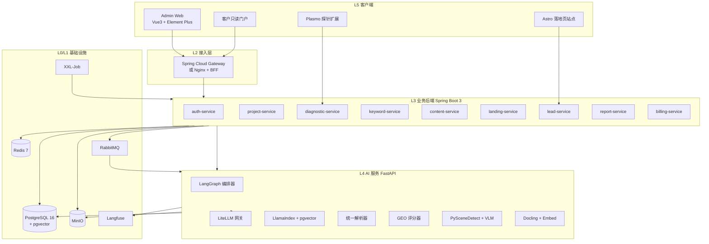
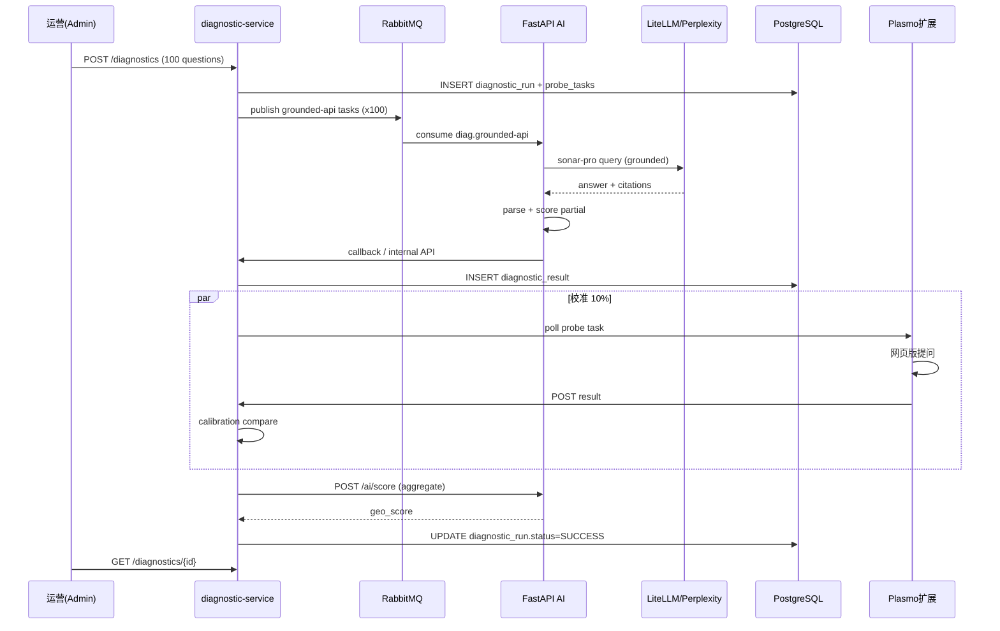

# 入境游海外获客增长 Agent — 技术栈架构文档

> 版本：V1.0 | 日期：2026-06-23 | 基线：PRD 商业化版 V2.0  
> 用途：AI Coding 工程基线 — 组件选型、系统分层、底座决策、部署拓扑

---

## 目录

1. [架构总览与分层原则](#1-架构总览与分层原则)
2. [平台底座选型决策](#2-平台底座选型决策)
3. [L0 基础设施层](#3-l0-基础设施层)
4. [L1 数据存储层](#4-l1-数据存储层)
5. [L2 接入与网关层](#5-l2-接入与网关层)
6. [L3 业务服务层（Java）](#6-l3-业务服务层java)
7. [L4 AI 服务层（Python）](#7-l4-ai-服务层python)
8. [L5 客户端层](#8-l5-客户端层)
9. [L6 探针与边缘层](#9-l6-探针与边缘层)
10. [L7 可观测与安全](#10-l7-可观测与安全)
11. [服务间通信与数据流](#11-服务间通信与数据流)
12. [代码仓库与模块结构](#12-代码仓库与模块结构)
13. [分阶段部署拓扑](#13-分阶段部署拓扑)
14. [EPIC → 组件对照表](#14-epic--组件对照表)
15. [风险、回滚与验证清单](#15-风险回滚与验证清单)

---

## 1. 架构总览与分层原则

### 1.1 七层架构模型

```
┌─────────────────────────────────────────────────────────────────────────┐
│ L5 客户端    │ Admin Web │ 客户门户 │ 落地页站点 │ Chrome 探针扩展      │
├─────────────────────────────────────────────────────────────────────────┤
│ L2 接入层    │ API Gateway / BFF │ JWT 鉴权 │ 限流 │ 租户路由           │
├─────────────────────────────────────────────────────────────────────────┤
│ L3 业务层    │ Spring Boot 3 模块化单体（MVP）→ 微服务（V2+）          │
│              │ 项目/诊断/关键词/内容/落地页/线索/报告/计费/权限         │
├─────────────────────────────────────────────────────────────────────────┤
│ L4 AI 层     │ FastAPI │ LiteLLM │ LangGraph │ LlamaIndex │ Docling     │
├─────────────────────────────────────────────────────────────────────────┤
│ L6 边缘层    │ Plasmo 扩展 │ Playwright Headless │ 探针调度器           │
├─────────────────────────────────────────────────────────────────────────┤
│ L1 数据层    │ PostgreSQL+pgvector │ Redis │ MinIO │ RabbitMQ           │
├─────────────────────────────────────────────────────────────────────────┤
│ L0 基础设施  │ Docker Compose → Kubernetes │ XXL-Job │ Langfuse         │
└─────────────────────────────────────────────────────────────────────────┘
```

### 1.2 核心设计原则

| 原则 | 说明 |
|------|------|
| **业务壁垒自建** | GEO 评分、八阶段词库、Prompt 模板、交付 SOP — 全部自研 |
| **基础设施用开源** | LLM/RAG/解析/调度/存储/可观测 — 不自研轮子 |
| **Java 管事务，Python 管 AI** | 强一致领域放 Java；模型/RAG/多模态放 Python，独立伸缩 |
| **异步优先** | 诊断/批量生成/向量化/报告导出走 MQ 异步，前端轮询或 WebSocket |
| **多租户贯穿** | 所有表 `tenant_id`；DAO 拦截器；OSS 路径隔离；JWT 租户上下文 |
| **GEO 必须 Grounded** | 诊断类调用强制联网检索，禁止裸模型结果充当 GEO 分数 |

### 1.3 总体架构图



---

## 2. 平台底座选型决策

### 2.1 为什么不选「一体化 BaaS / 低代码平台」

| 候选 | 排除原因 |
|------|----------|
| Supabase / Appwrite | 偏 Node/Edge 生态；多租户计费、GEO 探针、Agent 编排需大量二次开发 |
| Directus / Strapi | CMS 定位，不适合 Agent 工作流 + 探针调度 |
| Dify / LangChain Cloud | 适合 PoC；缺 SaaS 计费、线索 CRM、浏览器探针、白标报告 |
| JeecgBoot 全量采用 | 脚手架数据模型与业务域冲突；仅借 IAM/代码生成 |

### 2.2 推荐底座：**组装式开源栈（Compose 起步）**

```
底座 = Spring Boot 3 业务骨架
     + FastAPI AI 微服务
     + PostgreSQL（业务 + 向量合一）
     + 成熟中间件（Redis / MinIO / RabbitMQ / XXL-Job）
     + 可观测三件套（Langfuse + Prometheus + Loki）
```

**可选加速**：从 **RuoYi-Vue-Plus** 或 **JeecgBoot** 仅引入：
- 多租户 RBAC 脚手架
- 代码生成器（CRUD 加速）
- **不**采用其内置业务表

### 2.3 分阶段底座演进

| 阶段 | 时间 | 部署形态 | 数据库 | 向量 | 消息 |
|------|------|----------|--------|------|------|
| MVP | 0-8 周 | Docker Compose 3 容器组 | PG 单库 | pgvector | RabbitMQ |
| V1.0 商业版 | 2-4 月 | Compose + 独立 AI 节点 | PG 主从可选 | pgvector | RabbitMQ |
| V2.0 增长版 | 4-8 月 | K8s 初版 | PG 集群 | Qdrant | Kafka 可选 |
| V3.0 OEM | 8-12 月 | K8s + Helm Chart | 租户独立库 | Milvus 可选 | Kafka |

---

## 3. L0 基础设施层

### 3.1 容器与编排

| 组件 | 选型 | 版本 | 职责 |
|------|------|------|------|
| 容器运行时 | Docker | 24+ | 本地开发与 Compose 部署 |
| 编排（MVP） | Docker Compose | v2 | 一键拉起全栈 |
| 编排（V2+） | Kubernetes | 1.28+ | 多租户 SaaS 规模化 |
| 包管理（K8s） | Helm | 3.x | 私有化交付 Chart |
| 镜像仓库 | Harbor / GHCR | — | 私有化客户内网部署 |

### 3.2 任务调度

| 组件 | 选型 | 用途 |
|------|------|------|
| 定时任务 | **XXL-Job** 2.4+ | 周报生成、诊断周期监控、额度重置、报告推送 |
| 长流程（可选） | Temporal | V2+ 复杂 Agent 断点续跑、Saga 补偿 |

**XXL-Job 任务清单（MVP）：**

| Job 名称 | Cron | 执行者 |
|----------|------|--------|
| `weeklyReportGenerate` | 周一 08:00 | report-service |
| `diagnosticMonitor` | 每日 02:00 | diagnostic-service |
| `subscriptionQuotaReset` | 每月 1 日 00:00 | billing-service |
| `probeNodeHealthCheck` | 每 5 分钟 | diagnostic-service |
| `knowledgeReindex` | 手动触发 | AI embed worker |

### 3.3 反向代理（生产）

| 组件 | 选型 | 职责 |
|------|------|------|
| 入口 | Nginx / Traefik | TLS 终结、静态资源、落地页 CDN 回源 |
| API 网关 | Spring Cloud Gateway 4.x | 路由、限流、JWT 校验、租户头注入 |

---

## 4. L1 数据存储层

### 4.1 关系库 + 向量库（统一 PostgreSQL）

| 项 | 规格 |
|----|------|
| 引擎 | **PostgreSQL 16** |
| 扩展 | `pgvector` 0.7+、`pg_trgm`（关键词模糊搜索） |
| 镜像 | `pgvector/pgvector:pg16` |
| 连接池 | HikariCP（Java）/ SQLAlchemy async（Python） |
| 迁移 | Flyway（Java 侧统一管理 DDL） |
| DDL 基线 | `database/ddl/001_schema.sql`（28 表） |

**为何不用 MySQL + 独立向量库（MVP 阶段）：**
- pgvector 是 PG 扩展，双库运维成本高
- MVP 数据量 < 100 万向量，PG 足够
- 规模化后再拆：MySQL（事务）+ Qdrant/Milvus（向量）

### 4.2 Redis

| 用途 | Key 模式 | TTL |
|------|----------|-----|
| JWT 会话 | `session:{userId}` | 24h |
| 租户配额计数 | `quota:{tenantId}:{metric}` | 月底 |
| 诊断任务状态 | `diag:run:{runId}` | 7d |
| 分布式锁 | `lock:embed:{assetId}` | 30min |
| API 限流 | `ratelimit:{tenantId}:{api}` | 1min |
| 热点配置 | `config:platform_adapter:{platform}` | 1h |

**版本**：Redis 7.x，持久化 AOF。

### 4.3 对象存储 MinIO

| 路径规范 | 内容 |
|----------|------|
| `{tenant_id}/{project_id}/knowledge/{asset_id}/` | 原始文档 |
| `{tenant_id}/{project_id}/reports/{report_id}/` | DOCX/PDF 报告 |
| `{tenant_id}/{project_id}/materials/` | 素材图片/视频 |
| `{tenant_id}/{project_id}/probe/{run_id}/` | 探针截图 |
| `{tenant_id}/{project_id}/landing/{page_id}/` | 静态页面资源 |

**SDK**：Java 用 MinIO Java SDK；Python 用 `minio` 包；S3 兼容 API。

### 4.4 消息队列 RabbitMQ

| Exchange | Queue | 消费者 | 消息体 |
|----------|-------|--------|--------|
| `diag.direct` | `diag.grounded-api` | AI `/ai/diagnose` | `{runId, questionId, platform, region}` |
| `diag.direct` | `diag.probe-extension` | 探针调度器 | `{probeTaskId, question, platform}` |
| `ai.direct` | `ai.embed` | AI `/ai/embed` | `{assetId, fileUrl}` |
| `ai.direct` | `ai.content` | AI `/ai/content` | `{taskId, keywordId, ragContext}` |
| `ai.direct` | `ai.landing` | AI `/ai/landing` | `{pageId, keywordId}` |
| `ai.direct` | `ai.vision` | AI `/ai/vision/breakdown` | `{breakdownId, videoUrl}` |
| `report.direct` | `report.generate` | report-service | `{reportId, type, period}` |

**消息可靠性**：手动 ACK + 死信队列 `*.dlq` + 最多 3 次重试。

---

## 5. L2 接入与网关层

### 5.1 组件清单

| 组件 | 技术 | 职责 |
|------|------|------|
| API Gateway | Spring Cloud Gateway | 路由 `/api/v1/**` → 业务服务 |
| BFF（可选） | Spring WebFlux 或 Gateway Filter | 聚合 dashboard 多接口 |
| 鉴权 | Spring Security + JWT (RS256) | Access Token 2h + Refresh Token 7d |
| 权限 | **Casbin** | RBAC + 资源级（project_id 范围） |
| 限流 | Redis + Gateway RequestRateLimiter | 租户级 QPS |
| 租户解析 | Gateway Filter | JWT claim `tenant_id` → Header `X-Tenant-Id` |
| CORS | Gateway 全局配置 | Admin 域名白名单 |
| 公开端点 | 独立路由 `/api/v1/public/**` | 落地页表单，Turnstile 防刷 |

### 5.2 路由表（MVP）

| 前缀 | 目标 | 鉴权 |
|------|------|------|
| `/api/v1/auth/**` | auth-service | 公开（login/register） |
| `/api/v1/projects/**` | project-service | JWT + Casbin |
| `/api/v1/diagnostics/**` | diagnostic-service | JWT + Casbin |
| `/api/v1/probe/**` | diagnostic-service | 扩展节点 API Key |
| `/api/v1/content-tasks/**` | content-service | JWT + Casbin |
| `/api/v1/landing-pages/**` | landing-service | JWT + Casbin |
| `/api/v1/public/leads` | lead-service | Turnstile + 限流 |
| `/ai/**` | FastAPI（内网） | 服务间 mTLS / Internal Token |

### 5.3 统一响应格式

```json
{
  "code": 0,
  "message": "ok",
  "data": {},
  "trace_id": "tr_abc123"
}
```

---

## 6. L3 业务服务层（Java）

### 6.1 框架与依赖

| 类别 | 选型 | 版本 |
|------|------|------|
| 运行时 | JDK | 21 LTS |
| 框架 | Spring Boot | 3.3+ |
| ORM | MyBatis-Plus | 3.5+ |
| 连接池 | HikariCP | 内置 |
| 校验 | Jakarta Validation | 内置 |
| 文档 | SpringDoc OpenAPI | 2.x |
| 安全 | Spring Security + Casbin | — |
| 迁移 | Flyway | 10.x |
| 工具 | MapStruct + Lombok | — |

### 6.2 MVP 部署形态：模块化单体

MVP 阶段**不拆微服务**，一个 Spring Boot 应用按包划分模块，降低运维复杂度：

```
inbound-core/
├── inbound-api/          # Controller + DTO + OpenAPI
├── inbound-application/  # 应用服务 / 用例编排
├── inbound-domain/       # 领域模型 / 状态机 / 领域事件
├── inbound-infrastructure/
│   ├── persistence/      # MyBatis Mapper
│   ├── mq/               # RabbitMQ Producer/Consumer
│   ├── oss/              # MinIO Client
│   ├── redis/            # Redis Template
│   └── ai-client/        # Feign → FastAPI
└── inbound-bootstrap/    # SpringBoot 启动类
```

### 6.3 服务模块职责

#### 6.3.1 auth-service（认证与租户）

| 职责 | 关键类/接口 |
|------|-------------|
| 登录/注册/JWT 签发 | `AuthController`, `JwtTokenProvider` |
| 租户 CRUD | `TenantService` |
| 成员与角色 | `UserService`, `CasbinEnforcer` |
| 多租户拦截 | `TenantContextFilter`, `TenantLineHandler`（MyBatis-Plus） |

#### 6.3.2 project-service（客户项目与知识库）

| 职责 | 关键流程 |
|------|----------|
| 项目 CRUD | 品牌/官网/目标市场/竞品/路线 |
| 知识库上传 | 文件 → MinIO → 发 MQ `ai.embed` → 更新 `vector_status` |
| 知识库检索（代理） | 调 AI `/ai/rag/search`，不在 Java 侧做向量计算 |

#### 6.3.3 diagnostic-service（GEO 诊断 + 探针）

| 职责 | 关键流程 |
|------|----------|
| 创建诊断 | 写 `diagnostic_run` → 拆 `probe_task` → 按 mode 分发 MQ |
| Grounded API 路径 | MQ → AI `/ai/diagnose` → 回调写 `diagnostic_result` |
| 扩展探针路径 | 扩展 poll `/probe/tasks/poll` → 执行 → POST result |
| 评分聚合 | 全部子任务完成 → AI `/ai/score` → 更新 `geo_score` |
| 校准 | API vs 扩展结果对比 → `/diagnostics/{id}/calibration` |
| 探针节点管理 | 注册/心跳/禁用 |

**状态机**：`PENDING → RUNNING → SUCCESS | PARTIAL_FAILED | FAILED`

#### 6.3.4 keyword-service（关键词洞察）

| 职责 | 说明 |
|------|------|
| 机会词生成 | 调 AI `/ai/keywords`，结合八阶段词库规则 |
| 词库管理 | CRUD + 优先级排序 |
| 转任务 | `keyword → content_task / landing_page` |

#### 6.3.5 content-service（内容 Agent）

| 职责 | 说明 |
|------|------|
| 创建内容任务 | 写 `content_task` → MQ `ai.content` |
| 结果回写 | AI 回调 → `generated_content`，标记 `needs_human_review` |
| 发布计划 | `content_plan` 周计划 CRUD |

#### 6.3.6 landing-service（落地页 Agent）

| 职责 | 说明 |
|------|------|
| 页面草稿 | AI 生成 → `landing_page.content_json` |
| 在线编辑 | 对接 GrapesJS/Puck 配置 JSON |
| 发布（V2） | Astro SSG build → MinIO/CDN → `published_url` |
| 公开表单配置 | `form_config_json` |

#### 6.3.7 lead-service（线索 CRM）

| 职责 | 说明 |
|------|------|
| 公开表单 | `POST /public/leads` + Turnstile 验证 |
| 线索列表/分配 | 状态机 `NEW → FOLLOWING → QUOTED → WON/LOST` |
| 跟进记录 | `lead_followup` + AI 话术建议（调 `/ai/followup`） |
| 归因 | utm/keyword/landing_page 关联 |

#### 6.3.8 report-service（报告中心）

| 职责 | 说明 |
|------|------|
| 诊断报告 | 聚合 `diagnostic_result` → XDocReport 模板 → Gotenberg PDF |
| 周报/月报 | XXL-Job 触发 → 聚合多模块数据 |
| 白标 | `tenant.white_label_config` 注入模板 |

#### 6.3.9 billing-service（计费套餐）

| 职责 | 说明 |
|------|------|
| 套餐 CRUD | `subscription` + `quota_json` |
| 额度扣减 | 诊断/内容/落地页创建前检查 Redis 计数 |
| 超额拦截 | 返回 402 + 升级提示 |

---

## 7. L4 AI 服务层（Python）

### 7.1 框架与依赖

| 类别 | 选型 | 版本 |
|------|------|------|
| Web 框架 | FastAPI | 0.110+ |
| ASGI | Uvicorn | — |
| LLM 网关 | **LiteLLM** | 最新 |
| Agent 编排 | **LangGraph** | 0.2+ |
| RAG | **LlamaIndex** | 0.10+ |
| 文档解析 | **Docling** | 最新 |
| 重排序 | **bge-reranker-v2-m3** | 本地或 HF |
| Embedding | text-embedding-3-small / bge-m3 | 1536 维 |
| 向量驱动 | pgvector via `asyncpg` | — |
| 可观测 | **Langfuse** SDK | — |
| 视频 | PySceneDetect + ffmpeg | — |
| HTTP 客户端 | httpx | — |

### 7.2 目录结构

```
inbound-ai/
├── app/
│   ├── main.py                 # FastAPI 入口
│   ├── config.py               # 环境变量 / 模型路由配置
│   ├── routers/
│   │   ├── diagnose.py         # POST /ai/diagnose
│   │   ├── embed.py            # POST /ai/embed
│   │   ├── keywords.py         # POST /ai/keywords
│   │   ├── content.py          # POST /ai/content
│   │   ├── landing.py          # POST /ai/landing
│   │   ├── score.py            # POST /ai/score
│   │   ├── vision.py           # POST /ai/vision/breakdown
│   │   └── rag.py              # POST /ai/rag/search
│   ├── agents/                 # LangGraph 状态图
│   │   ├── diagnostic_agent.py
│   │   ├── keyword_agent.py
│   │   ├── content_agent.py
│   │   └── landing_agent.py
│   ├── tools/                  # Agent 可调工具
│   │   ├── rag_tool.py         # LlamaIndex 检索
│   │   ├── llm_tool.py         # LiteLLM 封装
│   │   └── parse_tool.py       # citations 解析
│   ├── services/
│   │   ├── llm_gateway.py      # 多供应商 + grounded 强制
│   │   ├── embed_service.py    # Docling → chunk → embed
│   │   ├── scorer.py           # GEO 评分算法
│   │   └── citation_parser.py  # 统一 citations 结构
│   ├── workers/                # RabbitMQ 消费者
│   │   ├── diagnose_worker.py
│   │   ├── embed_worker.py
│   │   └── content_worker.py
│   └── models/                 # Pydantic schemas
├── tests/
├── pyproject.toml
└── Dockerfile
```

### 7.3 LiteLLM 网关配置要点

```yaml
# 诊断任务路由 — 必须 grounded
diagnostic:
  default:
    model: perplexity/sonar-pro
    grounding_enabled: true
  fallback:
    - gemini/gemini-2.0-flash:grounding
    - openai/gpt-4o:web_search

# 内容/落地页 — RAG + 生成
content:
  default:
    model: openai/gpt-4o
  embedding:
    model: openai/text-embedding-3-small

# 成本归因
litellm_settings:
  success_callback: ["langfuse"]
  failure_callback: ["langfuse"]
```

**强制规则（代码层校验）：**
- `probe_mode=grounded-api` 时，`grounding_enabled` 必须为 `true`，否则拒绝执行
- GEO 诊断结果**不缓存** LLM 响应

### 7.4 LangGraph Agent 编排

| Agent | 输入 | 工具 | 输出 | HITL |
|-------|------|------|------|------|
| DiagnosticAgent | question, platform, region | LLM(grounded), ParseTool | diagnostic_result JSON | 可选人工校正 |
| KeywordAgent | project context, market | RAG, LLM, 八阶段规则 | keyword_opportunity[] | 否 |
| ContentAgent | keyword, platform, tone | RAG, LLM | generated_content | needs_human_review=true |
| LandingAgent | keyword, products | RAG, LLM | landing_page content_json | needs_human_review=true |
| FollowupAgent | lead context | RAG, LLM | followup suggestion | 否 |

**LangGraph 持久化**：Checkpoint 存 PostgreSQL（`langgraph_checkpoints` 表），支持断点续跑。

### 7.5 RAG 流水线

```
上传文件
  → MinIO 存储
  → Docling 解析（PDF/DOCX/PPT/图片 OCR）
  → 按 512 token 切片（overlap 64）
  → LiteLLM embedding → vector(1536)
  → 写入 knowledge_chunk
  → 更新 knowledge_asset.vector_status = READY

检索时：
  → 用户 query embed
  → pgvector cosine top-20
  → bge-reranker 重排 top-3
  → 注入 Prompt（附 chunk_id 来源）
```

### 7.6 GEO 评分器（scorer.py）

实现 PRD §10 加权算法：

| 指标 | 权重 | 数据来源 |
|------|:----:|----------|
| 品牌出现率 | 25% | diagnostic_result.mentioned_brands |
| Top3 推荐率 | 20% | diagnostic_result.rank |
| 竞品压制指数 | 15% | competitors_json 聚合 |
| 引用链接覆盖 | 15% | citations_json vs 客户 website |
| 长尾覆盖率 | 15% | is_longtail 问题子集 |
| 多平台一致性 | 10% | 跨 platform 方差 |

权重从 `scoring_rule.metric_weights_json` 读取，支持租户级配置。

---

## 8. L5 客户端层

### 8.1 Admin 管理后台

| 项 | 选型 |
|----|------|
| 框架 | Vue 3.4+ |
| 语言 | TypeScript 5+ |
| 构建 | Vite 5+ |
| UI | Element Plus 2.x |
| 状态 | Pinia |
| 路由 | Vue Router 4 |
| HTTP | Axios + 请求/响应拦截（JWT 刷新） |
| 富文本 | TipTap |
| 图表 | ECharts 5 |
| 国际化 | vue-i18n（Admin 中文为主，内容预览英文） |

**目录结构：**

```
inbound-admin/
├── src/
│   ├── api/           # 按模块封装 API
│   ├── views/         # 页面（对应 PRD §6 导航）
│   ├── components/
│   ├── stores/        # Pinia
│   ├── router/
│   └── utils/
├── vite.config.ts
└── package.json
```

**页面对应（PRD §6.1）：**

| 路由 | 页面 | 后端模块 |
|------|------|----------|
| `/dashboard` | 工作台 | project + report |
| `/projects/:id` | 客户项目 | project-service |
| `/diagnostics` | GEO 诊断 | diagnostic-service |
| `/keywords` | 关键词洞察 | keyword-service |
| `/content` | 内容 Agent | content-service |
| `/landing-pages` | 落地页 Agent | landing-service |
| `/leads` | 线索与转化 | lead-service |
| `/reports` | 报告中心 | report-service |
| `/settings` | 系统设置 | auth + billing |

### 8.2 客户只读门户

| 项 | 选型 |
|----|------|
| 框架 | Vue 3 或 Nuxt 3（SSG） |
| 范围 | 报告查看、任务进度、部分诊断结果 |
| 鉴权 | 只读 JWT 或 Magic Link |

### 8.3 落地页站点

| 项 | 选型 |
|----|------|
| 框架 | **Astro 4+**（SSG 为主） |
| 原因 | 静态 HTML、SEO/GEO 友好、Core Web Vitals 优 |
| 编辑器 | GrapesJS（Vue 栈）或 Puck（React 栈）→ 输出 JSON → Astro 模板渲染 |
| 表单 | 提交到 `POST /api/v1/public/leads` |
| WhatsApp | 预填消息 deep link |
| 防刷 | Cloudflare Turnstile |
| 托管 | MinIO 静态桶 + Nginx/CDN |
| 分析 | PostHog 自托管埋点 |

### 8.4 报告预览

- Admin 内嵌 PDF.js 预览 Gotenberg 输出的 PDF
- DOCX 下载直链 MinIO 签名 URL

---

## 9. L6 探针与边缘层

### 9.1 浏览器扩展（Plasmo）

| 项 | 规格 |
|----|------|
| 框架 | **Plasmo**（Chrome MV3 + TypeScript） |
| 通信 | HTTPS → diagnostic-service `/probe/tasks/poll` |
| 鉴权 | 节点 API Key（`probe_node.node_key`） |
| 采集 | 仅诊断任务指定问题，不上传其他会话 |
| 支持平台 | ChatGPT / Gemini / Perplexity 网页版（Adapter 配置驱动） |
| 上报 | `{answer, citations, screenshot_base64, platform, timestamp}` |

**扩展目录：**

```
inbound-probe-extension/
├── src/
│   ├── background.ts      # 任务轮询
│   ├── contents/          # 各平台 content script
│   ├── adapters/          # platform_adapter 本地缓存
│   └── popup/             # 节点状态 UI
├── package.json
└── plasmo.config.ts
```

### 9.2 Headless 兜底（Playwright）

| 项 | 规格 |
|----|------|
| 运行时 | Playwright + Python |
| 触发 | 扩展节点不足 / 校准任务 |
| 限制 | 低并发、高成本，仅兜底 |

### 9.3 平台 Adapter 配置层

存储于 `platform_adapter` 表，热更新到扩展/Headless：

```json
{
  "platform": "chatgpt",
  "dom_selectors": {
    "input": "[data-testid='prompt-textarea']",
    "submit": "[data-testid='send-button']",
    "answer": ".markdown",
    "citations": "a.citation"
  },
  "parse_rules": {
    "brand_mention": "regex:...",
    "rank_extraction": "ordered_list"
  }
}
```

---

## 10. L7 可观测与安全

### 10.1 可观测三件套

| 层 | 工具 | 采集内容 |
|----|------|----------|
| LLM 追踪 | **Langfuse**（自托管） | 每次 LLM 调用的 prompt/completion/token/成本/latency |
| 指标 | Prometheus + Grafana | QPS、MQ 积压、诊断完成率、任务耗时 |
| 日志 | Loki + Promtail | 结构化 JSON 日志，trace_id 关联 |
| 产品埋点 | **PostHog**（自托管） | 功能使用、转化漏斗、续费行为 |
| 错误追踪 | Sentry（可选） | 前后端异常 |

**Grafana Dashboard 清单：**
- 诊断任务完成率 / 失败率
- LLM 成本按租户/项目
- MQ 队列深度
- 探针节点在线数
- API P99 延迟

### 10.2 安全

| 项 | 方案 |
|----|------|
| 传输 | TLS 1.3（Nginx 终结） |
| 鉴权 | JWT RS256 + Refresh Token Rotation |
| 权限 | Casbin RBAC + project 级数据范围 |
| 多租户 | MyBatis TenantLine + OSS 路径隔离 + AI 检索 tenant 过滤 |
| API Key | `model_config.api_key_encrypted` AES-256-GCM |
| 公开表单 | Turnstile + IP 限流 + 蜜罐字段 |
| 审计 | `audit_log` 全量记录敏感操作 |
| 合规 | 扩展最小权限；素材版权提示；不承诺 GEO 排名 |

---

## 11. 服务间通信与数据流

### 11.1 诊断任务完整时序



### 11.2 知识库向量化时序

```
Admin 上传 PDF
  → project-service 存 MinIO + INSERT knowledge_asset(PENDING)
  → MQ ai.embed
  → embed_worker: Docling 解析 → 切片 → embedding
  → INSERT knowledge_chunk (pgvector)
  → UPDATE knowledge_asset(READY)
  → WebSocket/轮询通知 Admin
```

### 11.3 内容生成时序

```
运营选择关键词 → POST content-tasks
  → content-service INSERT content_task(GENERATING)
  → MQ ai.content
  → ContentAgent: RAG 检索 → LangGraph 生成
  → INSERT generated_content + needs_human_review=true
  → UPDATE content_task(GENERATED)
  → 运营审核 → ADOPTED / DISCARDED
```

### 11.4 通信协议汇总

| 路径 | 协议 | 格式 |
|------|------|------|
| 前端 → Gateway | HTTPS REST | JSON |
| Gateway → Java | HTTP 内部 | JSON |
| Java → AI | HTTP REST（内网 Token） | JSON |
| Java → AI（长任务） | RabbitMQ | JSON Message |
| AI → Java（回调） | HTTP REST | JSON |
| 扩展 → Java | HTTPS REST | JSON + Base64 screenshot |
| Java → MinIO | S3 API | Binary |
| AI → pgvector | PostgreSQL wire | SQL |

---

## 12. 代码仓库与模块结构

### 12.1 Monorepo 结构（当前仓库）

```
2026_Inbound_Tourism_Acquisition_OS/
├── README.md                    # 项目入口、快速开始、结构总览
├── CLAUDE.md                    # AI 助手项目上下文
├── AGENT.md                     # AI 编码 Agent 工作指南
├── PRD_商业化版_V2.0.md          # 产品需求工程基线
├── docs/
│   ├── README.md                # 文档索引
│   ├── ARCHITECTURE.md          # 本文档
│   └── TECH_STACK_COMPONENTS.md
├── database/
│   ├── README.md
│   └── ddl/
│       ├── 001_schema.sql
│       └── 002_seed_demo.sql
├── deploy/
│   ├── README.md
│   ├── docker-compose.yml
│   └── .env.example
├── inbound-core/                # ⏳ 待 scaffold（见目录内 README）
├── inbound-ai/                  # ⏳ 待 scaffold
├── inbound-admin/               # ⏳ 待 scaffold
├── inbound-landing/             # ⏳ 待 scaffold
├── inbound-probe-extension/     # ⏳ 待 scaffold
├── .cursor/                     # Cursor MCP / rules
└── .vscode/
```

> 应用子项目 scaffold 前，各 `inbound-*/README.md` 说明职责与目标目录结构。

### 12.2 Docker Compose 服务清单（MVP）

| Compose Service | 镜像/构建 | 端口 |
|-----------------|-----------|------|
| `postgres` | pgvector/pgvector:pg16 | 5432 |
| `redis` | redis:7-alpine | 6379 |
| `minio` | minio/minio | 9000, 9001 |
| `rabbitmq` | rabbitmq:3-management | 5672, 15672 |
| `xxl-job-admin` | xxl-job 官方 | 8088 |
| `langfuse` | langfuse/langfuse | 3000 |
| `core-api` | build inbound-core | 8080 |
| `ai-api` | build inbound-ai | 8090 |
| `admin-web` | build inbound-admin | 5173 |
| `nginx` | nginx:alpine | 80, 443 |

---

## 13. 分阶段部署拓扑

### 13.1 MVP（单机 Compose）

```
┌─────────────────────────────────────────────┐
│  单台云服务器 4C8G（或本地 dev）              │
│  ┌─────────┐ ┌─────────┐ ┌─────────────┐  │
│  │ nginx   │ │ core-api│ │ ai-api      │  │
│  └────┬────┘ └────┬────┘ └──────┬──────┘  │
│       │           │              │         │
│  ┌────┴───────────┴──────────────┴──────┐  │
│  │ postgres │ redis │ minio │ rabbitmq  │  │
│  └──────────────────────────────────────┘  │
└─────────────────────────────────────────────┘
```

### 13.2 V1.0 商业版（Compose 扩展）

- AI 服务独立节点（GPU 可选，bge-reranker 本地推理）
- PostgreSQL 主从（读副本给报表）
- MinIO 分布式模式（4 节点 erasure code）

### 13.3 V3.0 OEM 私有化（K8s）

```
Namespace per tenant（或 per deployment）
├── Ingress (customer-domain.com)
├── core-api (HPA 2-10)
├── ai-api (HPA 2-20)
├── admin-web (static CDN)
├── landing-pages (static CDN)
├── postgres (StatefulSet / 外部 RDS)
├── redis (StatefulSet / 外部 ElastiCache)
└── minio (StatefulSet / 外部 OSS)
```

---

## 14. EPIC → 组件对照表

| EPIC | 模块 | Java 服务 | AI 服务 | 前端 | 基础设施 |
|------|------|-----------|---------|------|----------|
| EPIC-1 基础平台 | 租户/权限/知识库 | auth + project | embed + rag | Admin 设置/项目 | PG, MinIO, Casbin |
| EPIC-2 GEO 诊断 | 诊断/探针 | diagnostic | diagnose + score + parse | Admin 诊断页 | RabbitMQ, Langfuse |
| EPIC-3 关键词 | 机会词 | keyword | keywords agent | Admin 关键词页 | LlamaIndex |
| EPIC-4 内容 Agent | 脚本/分镜 | content | content agent | Admin 内容页 | TipTap |
| EPIC-5 爆款素材 | 拆帧/素材库 | content | vision/breakdown | Admin 素材页 | PySceneDetect, MinIO |
| EPIC-6 落地页 | 页面生成/发布 | landing | landing agent | Admin + Astro | GrapesJS, Turnstile |
| EPIC-7 线索转化 | CRM/表单 | lead | followup agent | Admin 线索页 | PostHog |
| EPIC-8 报告 | 诊断/周报 | report | — | Admin 报告页 | XDocReport, Gotenberg |
| EPIC-9 计费 | 套餐/额度 | billing | — | Admin 计费页 | Redis 计数 |
| EPIC-10 AI 编排 | 网关/RAG/编排 | ai-client | 全部 AI 模块 | — | LiteLLM, LangGraph, pgvector |
| EPIC-11 浏览器探针 | 扩展/Adapter | diagnostic (probe) | parse-citations | — | Plasmo, Playwright |

---

## 15. 风险、回滚与验证清单

### 15.1 关键风险

| 风险 | 影响 | 缓解 |
|------|------|------|
| LLM 供应商限流/涨价 | 诊断失败/成本飙升 | LiteLLM 多供应商 fallback + 成本告警 |
| 平台 Adapter 失效 | 扩展探针采集失败 | 热更新 adapter + grounded-api 兜底 |
| pgvector 性能瓶颈 | RAG 延迟高 | ivfflat 索引 + reranker + 未来迁 Qdrant |
| 多租户数据泄漏 | 合规事故 | TenantLine 拦截器 + 集成测试 + 审计 |
| GEO 结果法律风险 | 客户误解 | 报告明确采样范围，不承诺排名 |

### 15.2 MVP 验证清单

- [ ] Compose 一键启动，28 表迁移成功
- [ ] Admin 登录 + 创建项目 + 上传知识库 → vector_status=READY
- [ ] 发起 10 题诊断（grounded-api）→ geo_score 计算正确
- [ ] 关键词 → 内容脚本生成 → needs_human_review=true
- [ ] 落地页草稿 → 公开表单 → lead 入库
- [ ] 周报 DOCX/PDF 导出
- [ ] Langfuse 可见 LLM trace + 成本
- [ ] 跨租户访问被拒绝（403）
- [ ] 探针扩展注册 + 执行 1 个校准任务

### 15.3 回滚策略

| 层 | 回滚方式 |
|----|----------|
| 数据库 | Flyway 版本回退；禁止破坏性 DDL 无备份 |
| Java/AI | Docker 镜像 tag 回滚上一版本 |
| 扩展 | Chrome Web Store 版本回退 / 企业策略强制版本 |
| Adapter | `platform_adapter` 表版本回滚 + 扩展缓存刷新 |

---

*本文档与 `PRD_商业化版_V2.0.md` §5、§9、§21 及 `database/ddl/001_schema.sql` 保持一致。后续变更请同步更新三处。*
